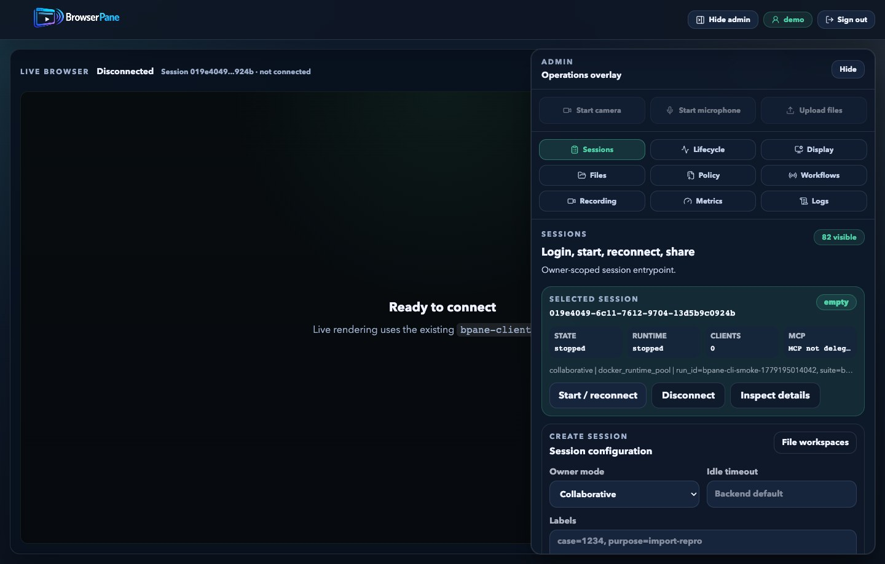
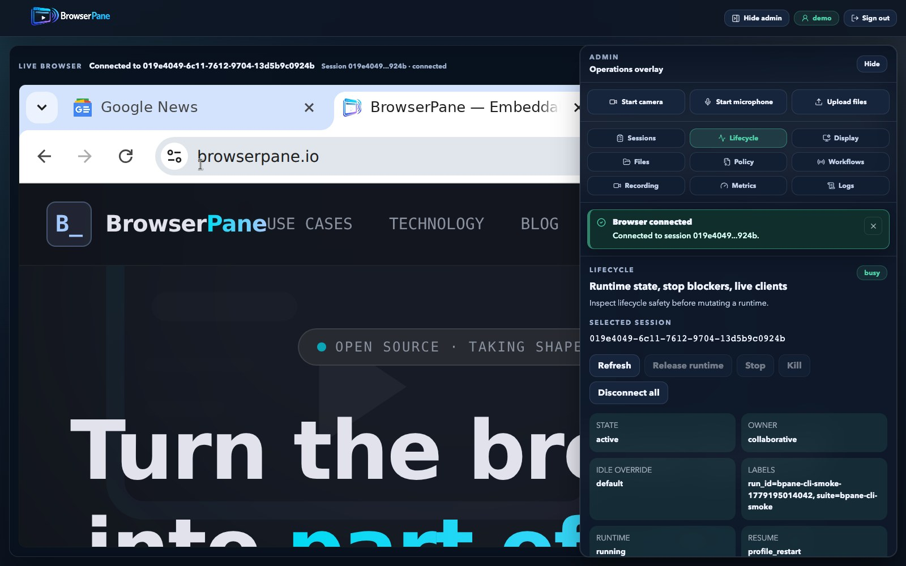
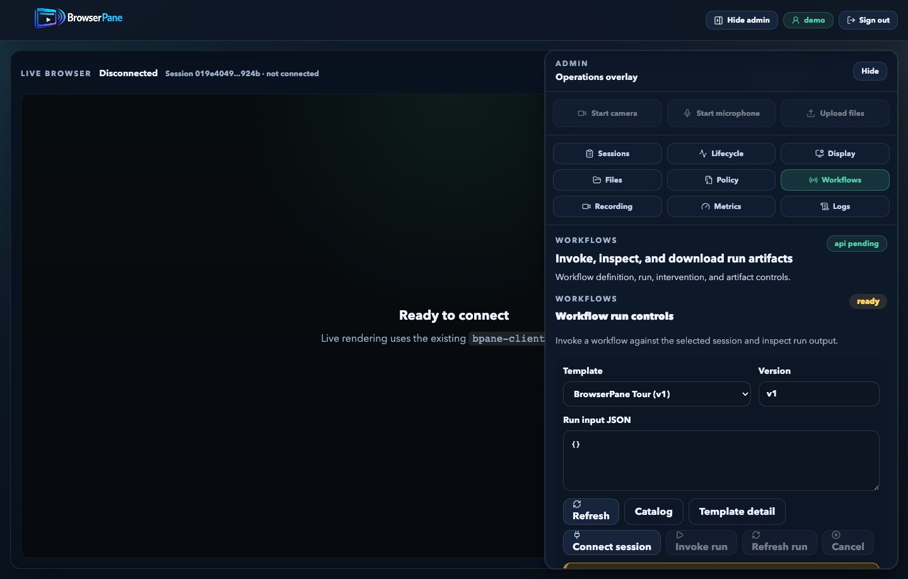
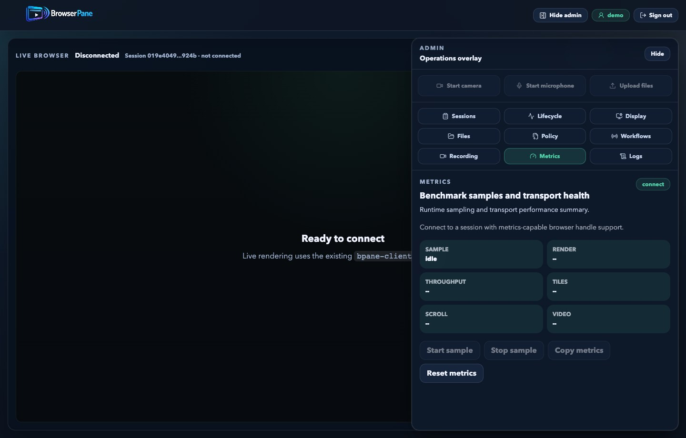
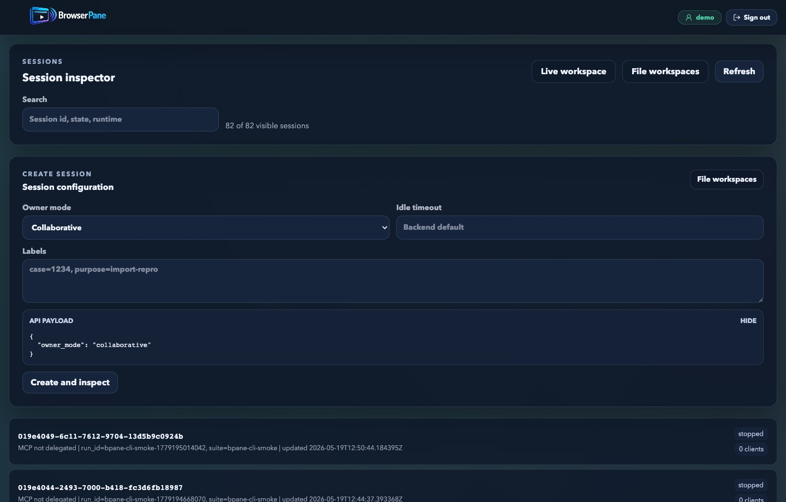
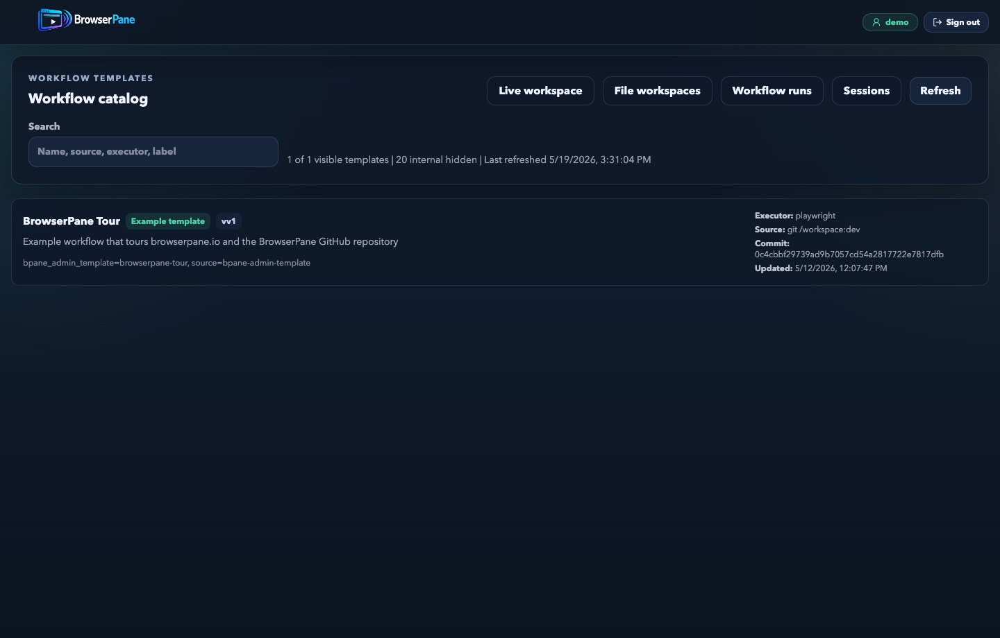
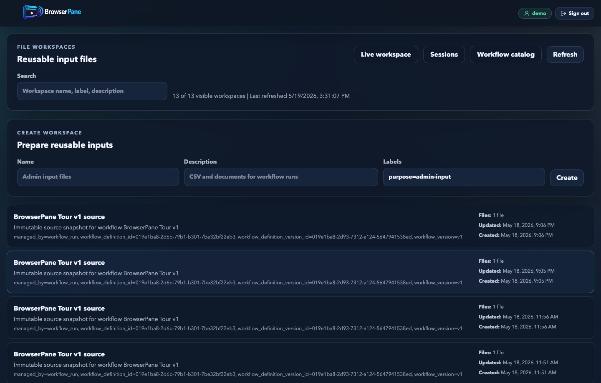

# BrowserPane

BrowserPane is a self-hostable remote browser and workflow execution platform for humans and agents.

Most browser automation products stop at managed browsers, CDP endpoints, or live debug links. BrowserPane treats the live browser session itself as the product surface: a real Chromium session that browser users, supervisors, and automation can all attach to with shared-session policy, owner/viewer controls, and persistent session resources.

The key technical difference is that BrowserPane includes its own host-layer remote browser stack. The Rust `bpane-host` process runs next to Chromium inside the Linux runtime, captures and classifies the desktop surface, streams tiles, ROI video, audio, cursor, clipboard, files, input, microphone, camera, and resize events through BrowserPane's protocol, and lets the web client render the live session in a regular browser page.

BrowserPane is intended to be integrated into larger automation and workflow systems. Its workflow layer is primarily about browser-run execution, supervision, artifacts, and human intervention around a live browser session, not about replacing a general scheduler or DAG orchestrator.

This means BrowserPane is not only a wrapper around Playwright, CDP, screenshots, or a hosted debug iframe. It owns the live browser transport path from the Linux host to the browser client.

Checkout on youtube: [https://www.youtube.com/watch?v=zhj2_B4vLMs](https://www.youtube.com/watch?v=zhj2_B4vLMs)

<p><strong>Admin live workspace tabs</strong></p>

<table>
  <tr>
    <td width="50%"></td>
    <td width="50%"></td>
  </tr>
  <tr>
    <td align="center"><sub>Sessions</sub></td>
    <td align="center"><sub>Lifecycle</sub></td>
  </tr>
  <tr>
    <td width="50%"></td>
    <td width="50%"></td>
  </tr>
  <tr>
    <td align="center"><sub>Workflows</sub></td>
    <td align="center"><sub>Metrics</sub></td>
  </tr>
</table>

<p><strong>Admin resource views</strong></p>

<table>
  <tr>
    <td></td>
    <td></td>
    <td></td>
  </tr>
  <tr>
    <td align="center"><sub>Sessions</sub></td>
    <td align="center"><sub>Workflow catalog</sub></td>
    <td align="center"><sub>File workspaces</sub></td>
  </tr>
</table>

The frozen v1 control-plane API contract now lives in [openapi/bpane-control-v1.yaml](openapi/bpane-control-v1.yaml).

## Why BrowserPane

BrowserPane will be worth considering if you need more than "a browser for an agent."

- BrowserPane owns the remote browser protocol. `bpane-host`, `bpane-gateway`, `bpane-protocol`, and `bpane-client` form a browser-native live session stack rather than delegating the user experience to a generic remote desktop product.
- Shared sessions are a first-class feature, not an afterthought. Multiple browser clients can join the same session with collaborative or restricted viewer behavior.
- Automation attaches to governed sessions instead of bypassing session policy. MCP and other automation flows operate through explicit ownership and session-control APIs.
- The remoting stack is browser-native. BrowserPane uses WebTransport plus a tile-first render path with optional ROI H.264 instead of relying only on full-frame streaming or vendor-hosted live debug UIs.
- The session behaves like a real remote workspace. Clipboard, file transfer, audio out, microphone in, camera ingress, resize, and input policy are part of the system design.
- The platform is self-hostable. Teams can run BrowserPane in their own environment instead of treating browser control as a SaaS-only dependency.

## Where It Fits

BrowserPane is a strong fit for:

- human-in-the-loop browser automation
- collaborative investigation, support, or review sessions
- regulated or private deployments that need self-hosted browser access
- workflow systems that need durable session identity, artifacts, logs, and audit history
- platforms that need a governed browser execution target inside a larger orchestration stack

## Current Status

BrowserPane is still experimental.

Current support and scope:

- Host runtime: Linux only. Ubuntu 24.04 container is the primary target.
- Browser runtime: Chromium desktop only. Firefox and Safari are not production targets.
- Shared sessions: collaborative by default, intended for small curated groups rather than broadcast-scale delivery.
- Owner/viewer mode: optional exclusive-owner mode is supported in the gateway; restricted viewers are read-only.
- Camera: disabled by default in the compose stack and requires browser H.264 encode support plus a mapped `v4l2loopback` device.
- Control plane: owner-scoped v1 APIs now cover sessions, session templates, egress profiles, automation tasks, session recordings, workflow definitions/runs, file workspaces, credential bindings, and approved extensions.
- Workflow execution: Git-backed workflow versions run through a gateway-managed `workflow-worker`; the current executor model is Playwright.
- Workflow boundary: BrowserPane currently focuses on executing and supervising browser workflows. Broader scheduling, DAG orchestration, and cross-system coordination are expected to sit above BrowserPane rather than inside it.

## How The System Is Shaped

At a high level, BrowserPane has five responsibilities:

1. Run a real browser session in a Linux host environment.
2. Capture and classify that surface efficiently.
3. Transport state, input, and media between host and browser.
4. Render the remote session in a regular web page.
5. Coordinate durable control-plane resources for sessions, workflows,
   recordings, files, credentials, extensions, and automation ownership.

The default local runtime looks like this:

```text
browser client
  <-> bpane-gateway
  <-> bpane-host
  <-> Chromium + Xorg/Openbox inside a Linux runtime

bpane-host captures the browser desktop surface and emits BrowserPane protocol frames.
bpane-gateway applies session policy and relays WebTransport traffic.
bpane-client renders the live session and sends input/media/file events back.

bpane-gateway also talks to:
  - postgres
  - mcp-bridge
  - workflow-worker
  - recording-worker
```

## Projects And Responsibilities

| Project | Responsibility |
| --- | --- |
| `code/apps/bpane-host` | Linux host agent. Captures the desktop surface, classifies tiles, drives ROI H.264 video, emits audio, injects input, and handles clipboard, file transfer, resize, and camera ingress plumbing. |
| `code/apps/bpane-gateway` | WebTransport entry point, shared-session coordinator, runtime lifecycle boundary, and owner-scoped control-plane API for sessions, session templates, automation tasks, recordings, workflows, files, credentials, and extensions. |
| `code/shared/bpane-protocol` | Shared binary wire contract. Defines channels, frame envelopes, typed protocol messages, and incremental frame decoding used by the Rust services and validated against the browser client. |
| `code/web/bpane-client` | Real browser client. Renders tiles/video, decodes media, captures keyboard/mouse/clipboard input, and manages browser-side audio, camera, and file-transfer flows. |
| `code/integrations/mcp-bridge` | Automation bridge for MCP/Playwright-style control flows. Exposes compatibility Streamable HTTP on `/mcp`, session-scoped Streamable HTTP on `/sessions/{id}/mcp`, compatibility SSE on `/sse`, session-scoped SSE on `/sessions/{id}/sse`, and integrates with gateway ownership APIs so automation can attach alongside interactive browser users through delegated session control. |
| `code/integrations/workflow-worker` | On-demand workflow executor. Downloads pinned workflow source snapshots, attaches with session automation access, runs Playwright workflow entrypoints, resolves credential/workspace inputs, and writes logs, outputs, and produced files back to the gateway. |
| `code/integrations/recording-worker` | On-demand recording executor. Attaches as a passive recorder client, captures WebM output, and finalizes recording metadata into gateway-managed artifact storage. |
| `deploy/` | Local runtime manifests and container images. This is the practical source of truth for how the dev stack is assembled and started. |

## Rendering Model

BrowserPane is not a simple full-frame video streamer.

- UI and text travel primarily over the reliable tile path.
- Media-heavy regions can move to ROI H.264 on the video path.
- Desktop audio travels separately from visual updates.
- Input, clipboard, file transfer, microphone, and camera each have dedicated protocol flows.

That split is what lets the system keep static UI sharp while still handling moving video efficiently.

## Protocol Model

The shared protocol is a compact binary protocol implemented in `bpane-protocol`.

- Reliable typed channels are used for control, input, cursor, clipboard, file transfer, and tiles.
- Raw media channels are used for video, desktop audio, microphone, and camera payloads.
- The protocol crate is the source of truth for frame/message definitions; the README stays intentionally high-level.

## Local Development

### Recommended: Docker Compose

The local session console now defaults to `docker_pool` mode so `Start New Session` provisions an isolated browser runtime instead of reusing one shared legacy worker:

Generate a dev certificate once:

```bash
./deploy/gen-dev-cert.sh dev/certs
```

Start the stack:

```bash
BPANE_GATEWAY_MAX_ACTIVE_RUNTIMES=2 \
docker compose -f deploy/compose.yml up --build
```

Then open `http://localhost:8080/admin/` in Chromium. The web root redirects to the admin console.

Use these local dev credentials on the login screen:

- username: `demo`
- password: `demo-demo`

Then:

1. Click `Login`
2. Click `Start New Session` to create a fresh browser, or select an older session and click `Join / Reconnect`
3. Open the same selected session in another signed-in browser window if you want to share it live with another user
4. Click `Delegate MCP` if you want the local `mcp-bridge` to drive that exact session
5. For external MCP clients, prefer the session-scoped URL shown in the admin MCP panel, for example `http://localhost:8931/sessions/{session_id}/mcp`

If you explicitly want the older single-runtime compatibility stack, opt into it:

```bash
BPANE_GATEWAY_RUNTIME_BACKEND=static_single \
docker compose -f deploy/compose.yml up --build
```

The compose stack starts:

- `host`: Linux host runtime with Xorg dummy, Openbox, Chromium, and `bpane-host`
- `gateway`: WebTransport relay on `:4433` and HTTP APIs on `:8932`
- `postgres`: session-control database on `:5433`
- `vault`: local HashiCorp Vault dev server on `:8200` for workflow credential bindings
- `keycloak`: local OIDC provider on `:8091`
- `web`: local frontend on `:8080`
- `mcp-bridge`: MCP bridge on `:8931` (`/sessions/{id}/mcp` for recommended session-scoped Streamable HTTP, `/sessions/{id}/sse` for session-scoped legacy SSE, `/mcp` and `/sse` for compatibility)

The local compose file also defines a `workflow-worker` image profile. The gateway launches workflow-worker containers on demand; you normally do not start that container as a long-lived service yourself.
The gateway mounts the repository at `/workspace:ro` for local git-backed workflow sources, and the gateway image configures `/workspace` as a trusted Git `safe.directory`.

The local MCP bridge uses the package-installed `@playwright/mcp` executable from its own dependencies. It should not download `@playwright/mcp@latest` on first connect; run `npm ci` in `code/integrations/mcp-bridge` or rebuild the image if that local executable is missing.

The gateway supports three runtime backends:

- `static_single`: one shared host worker
- `docker_single`: one start-on-demand runtime container with idle shutdown
- `docker_pool`: multiple start-on-demand runtime containers with explicit `max_active_runtimes` and `max_starting_runtimes`

`deploy/compose.yml` now defaults to `docker_pool`, but you can still switch backends explicitly when you need a compatibility check:

```bash
BPANE_GATEWAY_RUNTIME_BACKEND=docker_pool \
BPANE_GATEWAY_MAX_ACTIVE_RUNTIMES=2 \
docker compose -f deploy/compose.yml up --build
```

`deploy/compose.yml` now mounts Docker access into the gateway and forwards a shared host-worker env profile automatically. If your compose project name is not the default `deploy`, override these defaults too:

- `BPANE_GATEWAY_DOCKER_RUNTIME_IMAGE`
- `BPANE_GATEWAY_DOCKER_RUNTIME_NETWORK`
- `BPANE_GATEWAY_DOCKER_RUNTIME_SOCKET_VOLUME`
- `BPANE_GATEWAY_DOCKER_RUNTIME_SESSION_DATA_VOLUME_PREFIX`

The default local auth flow is OIDC-based:

- open `http://localhost:8080/admin/`
- click `Login`
- authenticate against the local Keycloak realm
- use the demo account `demo / demo-demo`
- return to the admin console and either select an existing session or create a new one, optionally from a session template and reusable browser context
- the admin console joins the selected owner-scoped `/api/v1/sessions` resource, or creates a new one before opening WebTransport
- the live session panel and session inspector show the applied template, and the inspector can filter sessions by template, lifecycle state, and runtime state
- sessions created from the admin console use a 5 minute idle timeout and are stopped automatically if they remain unused or become idle without any browser viewers or MCP owner
- reconnecting a stopped session now restarts the same session resource instead of creating a new one
- switching the selected session disconnects the embedded browser from the previous live session before selecting the new one
- the console UI now shows whether the currently selected session is the exact session delegated to the local MCP bridge
- in Docker-backed runtime modes, BrowserPane mounts session-specific browser data for the Chromium profile, uploads, and downloads so cookies, cache, downloads, and Chromium session-restore state survive worker restarts without sharing one browser data root across sessions
- Docker-backed runtime assignments are now persisted in Postgres and recovered on gateway restart, so an existing pool-mode worker can be rebound without launching a duplicate container
- exact in-memory browser process state is only preserved while the worker is still alive; once idle-stop shuts a worker down, reconnect restores the browser from its persisted profile rather than from a true container checkpoint
- if you want the local `mcp-bridge` to follow that same session, click `Delegate MCP`

The admin console fetches `/auth-config.json` and performs an Authorization Code + PKCE login. Admin API calls use the resulting OIDC bearer token.
Before WebTransport connect, the console mints a short-lived session-scoped connect ticket from the session API and uses that ticket on the transport URL instead of the long-lived bearer token. The legacy development harness remains available at `/test-embed.html` for smoke tests that still exercise harness-specific hooks.

For Chromium, WebTransport still needs trusted TLS on localhost. The current runtime SPKI fingerprint is served at:

```text
http://localhost:8080/cert-fingerprint
http://localhost:8080/cert-hash
```

`./deploy/gen-dev-cert.sh dev/certs` also refreshes `dev/certs/cert-fingerprint.txt` and `dev/certs/cert-hash.txt` from the same `cert.pem` for CLI and WebTransport certificate-hash use. The admin app and browser client request these local certificate metadata endpoints without browser cache reuse so certificate rotations can be picked up after reload.

If a manually launched local Chromium reports `Opening handshake failed` when joining a session, start it with the local QUIC origin and SPKI trust flags:

```bash
/Applications/Google\ Chrome.app/Contents/MacOS/Google\ Chrome \
  --origin-to-force-quic-on=localhost:4433 \
  --ignore-certificate-errors-spki-list="$(cat dev/certs/cert-fingerprint.txt)" \
  http://localhost:8080/admin/
```

### Remote / Self-Hosted Testing

The checked-in compose stack is a local development and regression environment,
not a production deployment guide. Remote testing needs HTTPS for the web UI,
a browser-trusted WebTransport gateway certificate, aligned OIDC issuer and
redirect settings, and private handling for dev-only services such as Postgres,
Vault, Keycloak admin surfaces, gateway internals, and the MCP bridge.

See [REMOTE_DEPLOYMENT.md](REMOTE_DEPLOYMENT.md) for the current remote
deployment assumptions and compose override notes.

### Session Control Plane

The local stack now includes a frozen v1 session control plane in `bpane-gateway`.

Canonical contract:

- [openapi/bpane-control-v1.yaml](openapi/bpane-control-v1.yaml)

- `POST /api/v1/sessions`
- `GET /api/v1/sessions`
- `GET /api/v1/sessions/{id}`
- `DELETE /api/v1/sessions/{id}`
- `POST /api/v1/browser-contexts`
- `GET /api/v1/browser-contexts`
- `GET /api/v1/browser-contexts/{id}`
- `POST /api/v1/browser-contexts/{id}/clone`
- `GET /api/v1/browser-contexts/{id}/export`
- `POST /api/v1/browser-contexts/import`
- `DELETE /api/v1/browser-contexts/{id}`
- `POST /api/v1/session-templates`
- `GET /api/v1/session-templates`
- `GET /api/v1/session-templates/{id}`
- `PUT /api/v1/session-templates/{id}`
- `POST /api/v1/projects`
- `GET /api/v1/projects`
- `GET /api/v1/projects/{id}`
- `PUT /api/v1/projects/{id}`
- `GET /api/v1/projects/{id}/usage`
- `POST /api/v1/egress-profiles`
- `GET /api/v1/egress-profiles`
- `GET /api/v1/egress-profiles/{id}`
- `PUT /api/v1/egress-profiles/{id}`
- `GET /api/v1/egress-profiles/{id}/diagnostics`
- `GET /api/v1/sessions/{id}/egress-diagnostics`
- `POST /api/v1/sessions/{id}/egress-diagnostics`

These endpoints are bearer-protected, owner-scoped, and stored in Postgres. The
full contract is in the OpenAPI file; the route lists below call out the
operator-facing surfaces that are most relevant for local development.

Session templates store reusable defaults for session creation, including owner
mode, project id, viewport, idle timeout, labels, integration context, network identity, and recording policy.
Creating a session with a UUID `template_id` merges those defaults before the
session is persisted; explicit caller fields win over template defaults.
The admin create-session configurator follows the same rule: selecting a
template leaves owner mode and idle timeout unset unless the operator chooses an
explicit override, and the API payload preview shows the exact fields that will
be sent.
`GET /api/v1/sessions` accepts catalog filters such as `template_id`, `state`,
`runtime_state`, `label.<key>`, `integration.<key>`, `limit`, and `offset`.
Project resources let operators group sessions under an owner-scoped tenant,
case, customer, or environment boundary. A project carries labels, lifecycle
state, optional quotas such as `max_active_sessions`, and sanitized usage
counters. Creating a session with `project_id` records the admission decision on
the session and enforces active-session quota and archived-project checks before
runtime launch. Session resources and `/status` include the project summary and
admission reason so the admin live view, inspector, CLI, and API clients all
show whether a session was admitted under a project quota or left owner-scoped.
Network identity metadata lets callers declare locale, language preferences,
timezone, geolocation, browser identity, user-agent override, and an
`egress_profile_id` on either a session template or an explicit session create
payload. Egress profiles are owner-scoped resources with safe proxy metadata,
bypass rules, optional credential-binding references for proxy auth, custom CA
references, state, labels, and sanitized effective status; session resources,
`/status`, and `/egress-diagnostics` include the inherited network identity,
effective egress summary, and sanitized diagnostics without embedding proxy
credentials or raw CA material. Diagnostics distinguish
configuration-only evidence, runtime launch metadata, and the latest active
profile or browser probe. Egress-profile probes perform a real proxy request
and, when a proxy credential binding is configured, resolve the binding only for
that probe so operators can see whether proxy authentication succeeds or is
rejected. The active browser probe runs only against an already-ready session
runtime and stores sanitized public-IP, TLS issuer, and failure summary fields;
diagnostics do not store requested URLs, headers, proxy credentials, CA
material, or decrypted traffic.
Egress-side communication tracking belongs at the configured proxy or secure
web gateway. BrowserPane emits safe correlation metadata instead: docker-backed
runtime containers carry `browserpane.session_id` and egress-profile labels,
and the gateway logs a sanitized runtime startup event that joins the session,
runtime container, and egress profile. A runnable local Squid access-log example
is available in `deploy/examples/egress-observer`.
Egress profiles default to `traffic_observation.mode=metadata_only`. Full HTTPS
inspection must be explicit with `mode=tls_intercept`, and the API requires a
proxy, custom CA reference, and `sensitive_log_sink_ref` so operators do not
enable decrypted traffic logging without an approved SIEM/log-storage target.
Docker-backed runtimes materialize `file://` or absolute-path custom CA bundle
references into the session data volume and install them into Chromium's NSS
trust store before launch; non-file CA providers remain a provider-integration
follow-up. If `proxy.credential_binding_id` is set, the gateway resolves the
owner-visible credential binding through the configured secret provider at
runtime launch and writes only a session-local proxy-auth file; credentials are
not embedded in proxy URLs, API responses, CLI output, Docker labels, or normal
logs.
Browser context resources let callers name owner-scoped Chromium profile
contexts and bind new sessions with `browser_context.mode=reusable` plus a
`context_id`. Docker-backed runtimes materialize reusable contexts as a
context-scoped Chromium profile volume mounted at the normal profile path,
while uploads, downloads, and session-file mounts remain tied to the concrete
session. Only one active runtime writer may use a reusable context at a time;
additional sessions with the same context can be created but runtime access is
rejected until the active writer stops or releases its runtime.
Browser context resources include a `usage` summary with the current visible
session reference count and the active runtime writer session id, when one
exists. Docker-backed runtimes also include approximate profile storage bytes
when Docker volume-size inspection is available. Contexts can carry an optional
`max_profile_storage_bytes` limit; once the inspected profile size exceeds that
limit, the API reports `usage.profile_storage_limit_exceeded=true` and rejects
new reusable sessions from that context until the operator deletes or replaces
the context. Contexts can also carry an optional `retention_sec` window; the API
returns `retention_expires_at` from the last-used timestamp, or creation time if
the context has never been used. The gateway scans for expired ready contexts on
startup and then every `--browser-context-retention-cleanup-interval-secs`
seconds, unless that interval is set to `0`; docker-backed cleanup removes the
context profile volume and skips active runtime writers for a later pass. API
clients and the admin UI use these fields to make the same lifecycle and cleanup
decisions.
Inactive reusable contexts can be cloned with
`POST /api/v1/browser-contexts/{id}/clone`; docker-backed runtimes copy the
source Chromium profile volume into a new context-scoped profile volume when the
source volume exists, while static runtimes treat clone as metadata-only.
Inactive reusable contexts can also be exported with
`GET /api/v1/browser-contexts/{id}/export`; the response is a zip archive with
`manifest.json` and, for docker-backed contexts with profile data,
`profile.tar.gz`.
BrowserPane export archives can be imported as new reusable contexts with
`POST /api/v1/browser-contexts/import` using `application/zip` plus
`x-bpane-browser-context-name`. Omitted metadata defaults to the archive
manifest, and imports never overwrite an existing context.
Deleting a reusable context refuses active runtime writers and, for
docker-backed runtimes, removes the context-scoped Chromium profile volume when
no active writer exists. The admin create-session configurator can create
reusable context catalog entries, select a ready context for a new session,
preview the resulting `browser_context` payload, and show the bound context in
live session rows and the session inspector detail view. The admin operations
overlay and `/admin/browser-contexts` route also expose a reusable-context
catalog with session references, guarded clone/export/import/delete, and copyable API
examples.

The admin console also uses a bearer-protected realtime WebSocket for
owner-scoped snapshot updates:

- `GET /api/v1/admin/events`

The same frozen API surface also includes session-scoped runtime routes:

- `POST /api/v1/sessions/{id}/access-tokens`
- `POST /api/v1/sessions/{id}/automation-access`
- `GET /api/v1/sessions/{id}/status`
- `POST /api/v1/sessions/{id}/stop`
- `POST /api/v1/sessions/{id}/release`
- `POST /api/v1/sessions/{id}/kill`
- `POST /api/v1/sessions/{id}/connections/{connection_id}/disconnect`
- `POST /api/v1/sessions/{id}/connections/disconnect-all`
- `POST /api/v1/sessions/{id}/mcp-owner`
- `DELETE /api/v1/sessions/{id}/mcp-owner`
- `POST /api/v1/sessions/{id}/automation-owner`
- `DELETE /api/v1/sessions/{id}/automation-owner`

Session-scoped file binding routes let owners attach existing workspace files
to a session-level mount contract and let owners or automation read those bound
resources through the API:

- `POST /api/v1/sessions/{id}/file-bindings`
- `GET /api/v1/sessions/{id}/file-bindings`
- `GET /api/v1/sessions/{id}/file-bindings/{binding_id}`
- `GET /api/v1/sessions/{id}/file-bindings/{binding_id}/content`
- `DELETE /api/v1/sessions/{id}/file-bindings/{binding_id}`
- `GET /api/v1/sessions/{id}/files`
- `GET /api/v1/sessions/{id}/files/{file_id}`
- `GET /api/v1/sessions/{id}/files/{file_id}/content`

Bindings snapshot workspace-file metadata, enforce relative mount paths, reject
duplicate active mount paths per session, and allow session automation access to
read/list bound file resources. The file-inspection/download APIs are available
today; browser-container mount materialization is a separate runtime concern.

Session resources and status responses now expose a richer lifecycle model:

- persisted `state`
- derived `runtime_state`
- derived `runtime_resume_mode`
- derived `presence_state`
- `connection_counts` by role
- live `connections` descriptors on the status route
- `stop_eligibility` with blocker details
- idle timing metadata
- `runtime_released_at` and `stopped_at` timestamps
- side-effect-free status snapshots, including for stopped sessions

Lifecycle control semantics are now explicit:

- `DELETE /api/v1/sessions/{id}` follows safe-stop semantics
- `POST /api/v1/sessions/{id}/stop` stops only when no blockers remain
- `POST /api/v1/sessions/{id}/release` releases the live runtime while preserving the session resource and profile
- `POST /api/v1/sessions/{id}/kill` force-terminates live attachments and releases the runtime
- connection-level disconnect routes remove live attachments without stopping the session runtime

The local dev flow uses those routes to bridge browser-owned and automation-owned control:

- the admin console resolves or creates an owner-scoped session before connect
- it then mints a short-lived `session_connect_ticket` from `POST /api/v1/sessions/{id}/access-tokens`
- the gateway routes the WebTransport connect through that explicit session id instead of one global token path
- `Delegate MCP` assigns that session to the local `bpane-mcp-bridge` service principal
- the console then calls `mcp-bridge` on `:8931/control-session` so the bridge adopts that same session for later ownership/status calls
- external MCP clients can avoid the mutable bridge control target by connecting
  directly to `:8931/sessions/{session_id}/mcp` after that session is delegated
- `/control-session` remains a local compatibility control target. It is useful
  for the legacy test page and single-target tooling, but it is not the
  recommended external-client mode when multiple BrowserPane sessions may be
  delegated at the same time.
- the local `mcp-bridge` now resolves the managed session's runtime CDP endpoint from the session resource, so delegated control also works in `docker_pool` mode

MCP delegation terminology:

- gateway delegation: the owner grants the `bpane-mcp-bridge` service principal
  access to a session through `POST /api/v1/sessions/{id}/automation-owner`
- bridge-adopted session: the compatibility `/control-session` pointer targets
  that session
- MCP-owned session: the bridge has claimed session-scoped `/mcp-owner` while
  at least one MCP client is active
- connected MCP client: one streamable HTTP or SSE MCP transport is bound to a
  bridge target; with `/sessions/{id}/mcp` that target is immutable for the
  connection lifetime

Supported local operator CLI:

- Repo-level wrapper: `./scripts/bpane <command>`
- Package entrypoint: `cd code/web/bpane-client && npm run bpane:cli -- <command>`
- Installable package binary name: `bpane`
- Configuration precedence: command flags, environment variables, selected
  profile, then local defaults
- Local profile path: `~/.config/bpane/config.json`, override with
  `BPANE_CONFIG` or `--config`
- Profile selection: `BPANE_PROFILE` or `--profile`
- Gateway URL source: `BPANE_BASE_URL`, `BPANE_API_URL`, `--base-url`, or
  `--api-url`
- Bearer token source: `BPANE_ACCESS_TOKEN`, `--access-token`, or `--token`
- Profile files are written with `0600` permissions; access tokens are only
  persisted when `profile init` is run with `--save-token`
- Successful responses and CLI errors are emitted as structured JSON; unknown
  options fail as usage errors instead of being ignored

Minimal local operator setup:

```bash
export BPANE_ACCESS_TOKEN=<owner bearer token>
./scripts/bpane profile init local \
  --base-url http://localhost:8080 \
  --mcp-control-url http://localhost:8931/control-session \
  --set-default
```

Common session operations:

```bash
./scripts/bpane session list
./scripts/bpane session list --state stopped --label suite=smoke --limit 5
./scripts/bpane session list --template-id <template-id> --label team=support
./scripts/bpane session create --label purpose=manual-test
./scripts/bpane session create --project-id <project-id> --label purpose=tenant-test
./scripts/bpane session create --browser-context-id <context-id> --label purpose=context-test
./scripts/bpane session create \
  --locale de-DE \
  --language de-DE \
  --language en-US \
  --timezone Europe/Berlin \
  --egress-profile-id <egress-profile-id> \
  --label purpose=regional-test
./scripts/bpane session get <session-id>
./scripts/bpane session status <session-id>
./scripts/bpane session access-token <session-id>
./scripts/bpane session automation-access <session-id>
./scripts/bpane session disconnect-all <session-id>
./scripts/bpane session stop <session-id>
./scripts/bpane session kill <session-id>
```

Common session-template operations:

```bash
./scripts/bpane session-template create customer-debug-session \
  --description "Support debug sessions" \
  --label team=support \
  --default-label purpose=debug \
  --owner-mode collaborative \
  --idle-timeout-sec 1800 \
  --recording-mode manual
./scripts/bpane session-template list
./scripts/bpane session-template get <template-id>
./scripts/bpane session-template update <template-id> --name customer-debug-session --default-label purpose=debug
./scripts/bpane session create --template-id <template-id> --label case=INC-1234
```

Common project operations:

```bash
./scripts/bpane project create support-tenant \
  --description "Support tenant quota" \
  --label tenant=support \
  --max-active-sessions 3 \
  --max-active-workflow-runs 4 \
  --max-retained-storage-bytes 1073741824
./scripts/bpane project list
./scripts/bpane project get <project-id>
./scripts/bpane project usage <project-id>
./scripts/bpane project update <project-id> --name support-tenant --max-active-sessions 5
./scripts/bpane project archive <project-id>
./scripts/bpane session-template create tenant-debug-session --project-id <project-id> --default-label purpose=debug
```

Common egress-profile operations:

```bash
./scripts/bpane egress-profile create eu-support-egress \
  --description "Approved support outbound path" \
  --label region=eu \
  --proxy-url https://proxy.example:8443 \
  --proxy-credential-binding-id <credential-binding-id> \
  --bypass-rule localhost \
  --bypass-rule "*.internal.example" \
  --custom-ca-ref vault://pki/browserpane/eu-support \
  --custom-ca-name "EU support CA"
./scripts/bpane egress-profile list
./scripts/bpane egress-profile get <egress-profile-id>
./scripts/bpane egress-profile diagnostics <egress-profile-id>
./scripts/bpane egress-profile update <egress-profile-id> --name eu-support-egress-v2 --label managed=true
./scripts/bpane egress-profile disable <egress-profile-id>
./scripts/bpane session egress-diagnostics <session-id>
./scripts/bpane session egress-diagnostics probe <session-id>
```

Omit `--proxy-credential-binding-id` for proxies that do not require
authentication.

For a proxy that performs approved TLS interception, make that explicit and
name the sensitive-log sink:

```bash
./scripts/bpane egress-profile create inspected-support-egress \
  --proxy-url https://inspect-proxy.example:8443 \
  --custom-ca-ref file:///workspace/dev/egress-ca.pem \
  --custom-ca-name "Support inspection CA" \
  --traffic-observation-mode tls_intercept \
  --sensitive-log-sink-ref siem://browserpane/support-egress \
  --sensitive-log-sink-name "Support SIEM"
```

To observe egress traffic locally without changing the BrowserPane gateway,
start the normal compose stack first, then start the example forward proxies and
point an egress profile at one of them:

```bash
docker compose -f deploy/examples/egress-observer/compose.yml up --build
./scripts/bpane egress-profile create local-egress-observer \
  --proxy-url http://bpane-egress-observer:3128 \
  --bypass-rule localhost \
  --bypass-rule 127.0.0.1
docker compose -f deploy/examples/egress-observer/compose.yml logs -f egress-proxy
deploy/examples/egress-observer/correlate-session-ip.sh
```

The same compose file also starts an authenticated Squid fixture at
`bpane-egress-auth-observer:3130` with local test credentials
`proxy-user / proxy-pass`. Create a credential binding through the admin app or
`POST /api/v1/credential-bindings`, attach its id with
`--proxy-credential-binding-id`, and run
`./scripts/bpane egress-profile diagnostics probe <egress-profile-id>` to prove
the proxy accepts the binding. Bad credentials or unavailable secret backends
surface as sanitized diagnostics instead of returning the secret value.

For local HTTPS interception, run the mitmproxy-backed observer alongside the
plain Squid observer:

```bash
docker compose -f deploy/examples/egress-observer/compose.yml up -d
deploy/examples/egress-observer/prepare-mitmproxy-ca.sh
docker compose -f deploy/examples/egress-observer/compose.tls.yml up -d
./scripts/bpane egress-profile create local-tls-observer \
  --proxy-url http://bpane-egress-tls-observer:3129 \
  --custom-ca-ref file:///workspace/dev/egress-ca.pem \
  --custom-ca-name "BrowserPane Local Egress Test CA" \
  --traffic-observation-mode tls_intercept \
  --sensitive-log-sink-ref siem://browserpane/local-egress \
  --sensitive-log-sink-name "Local Egress SIEM"
```

Sessions using that profile should show certificates issued by the local egress
CA in the remote Chromium certificate viewer. The TLS observer logs decrypted
request metadata and should only be used for local development or an approved
sensitive-log sink.

On `localhost`, the admin app auto-creates two owner-scoped local presets when
it loads the egress catalog: `Local: Egress as Proxy` and `Local: Egress as TLS
Interceptor`. The session configurator groups egress choices as `No egress`,
`Egress as Proxy`, and `Egress as TLS Interceptor` so local testers can compare
all three modes.

The admin Operations Overlay also includes an egress profile catalog for
creating, cloning, editing, and disabling approved outbound profiles. The
catalog shows sanitized proxy, TLS-inspection, custom-CA, log-sink status, and
proxy-auth binding status, plus diagnostics health. Session diagnostics move
from configuration proof to runtime launch metadata once the selected profile
has been applied to a live runtime, and to active-probe proof after the operator
runs an egress probe from the live or detail session view. Run the probe after
connecting or starting the session; otherwise diagnostics record a sanitized
"runtime not ready" failure instead of
launching a browser implicitly. The probe can optionally receive
`public_ip_url`, `tls_probe_url`, and `timeout_ms` in the API or the matching
CLI options `--probe-public-ip-url`, `--probe-tls-url`, and
`--probe-timeout-ms`.

```bash
cd code/web/bpane-client && npm run smoke:admin-egress-profiles -- --headless
```

Common browser-context operations:

```bash
./scripts/bpane browser-context create support-profile --label team=support --retention-sec 604800 --max-profile-storage-bytes 536870912
./scripts/bpane browser-context clone <context-id> support-profile-sandbox --label copy=sandbox
./scripts/bpane browser-context export <context-id> --output support-profile.zip
./scripts/bpane browser-context import --input support-profile.zip --name support-profile-restored --label restored=true
./scripts/bpane browser-context list
./scripts/bpane browser-context get <context-id>
./scripts/bpane browser-context delete <context-id>
cd code/web/bpane-client && npm run smoke:admin-browser-contexts -- --headless
```

MCP delegation and recovery operations:

```bash
./scripts/bpane mcp health
./scripts/bpane mcp authorize <session-id>
./scripts/bpane mcp set-default <session-id>
./scripts/bpane mcp doctor <session-id>
./scripts/bpane mcp preflight <session-id>
./scripts/bpane mcp repair <session-id>
./scripts/bpane mcp revoke <session-id>
./scripts/bpane mcp clear-default
```

Use `mcp repair <session-id>` when the intended session should be delegated to
the configured bridge client and selected as the bridge default target. It
applies the missing delegation/default-session changes and then reruns strict
diagnostics. Repair refuses to mutate delegation or the bridge default target
unless the session is visible to the current owner token. Use `session cleanup`
as a dry-run first, or pass `--dry-run` to force preview mode. Add `--confirm`
with at least one bounding `--label` or `--older-than-sec` filter for
destructive cleanup.

The operator CLI integration smoke is
`cd code/web/bpane-client && npm run smoke:bpane-cli -- --headless`. It logs in
through the admin app, creates a session, initializes a CLI profile, exercises
project/session-template/browser-context/egress catalog operations,
session access/status/diagnostics/disconnect/stop/kill/cleanup, and validates
standalone MCP health, authorize, set-default, doctor, preflight, repair,
revoke, and clear-default flows.

Current runtime notes:

- the public session resource model is now versioned and persistent
- gateway transport and runtime compatibility APIs are now session-scoped
- gateway runtime orchestration now goes through an internal `SessionManager` boundary; the current runtime backend implementation still lives in `runtime_manager.rs`
- the default local compose runtime backend is `docker_pool`; the `legacy_single_runtime` compatibility mode remains available through `static_single` and `docker_single` checks
- the optional `docker_single` backend can now start and stop one runtime container for the active session
- the optional `docker_pool` backend can start multiple runtime containers in parallel, but only up to its configured runtime caps
- Docker-backed runtime assignment metadata is now persisted and reconciled on gateway startup so pool-mode workers can survive a gateway restart cleanly
- `mcp-bridge` keeps `/control-session` as a compatibility control target and
  supports recommended per-connection session routing through
  `/sessions/{session_id}/mcp` and `/sessions/{session_id}/sse`
- `mcp-bridge` exposes `/health.managed_sessions` so multi-session clients can
  inspect each active control/session-bound target without relying only on the
  legacy `control_session_*` fields
- the default compose stack runs `docker_pool` for local multi-session testing
- global compatibility routes like `/api/session/status` and `/api/session/mcp-owner` are compatibility-only and are not part of the frozen v1 contract; multi-runtime backends should use session-scoped `/api/v1/sessions/{id}/...` routes

### Recordings

BrowserPane session recording is now a control-plane feature rather than only a browser-local blob download.

- Session recording policy supports `disabled`, `manual`, and `always`.
- Recording resources are session-scoped and persist segment metadata, runtime state, termination reason, and artifact linkage.
- Recordings can be downloaded from the admin recording library, the legacy dev
  harness where applicable, or through the v1 API.
- Playback/export is modeled separately from raw recording segments, so multi-segment sessions stay explicit.

Primary routes:

- `POST /api/v1/sessions/{id}/recordings`
- `GET /api/v1/sessions/{id}/recordings`
- `GET /api/v1/sessions/{id}/recordings/{recording_id}`
- `POST /api/v1/sessions/{id}/recordings/{recording_id}/stop`
- `GET /api/v1/sessions/{id}/recordings/{recording_id}/content`
- `GET /api/v1/sessions/{id}/recording-playback`
- `GET /api/v1/sessions/{id}/recording-playback/manifest`
- `GET /api/v1/sessions/{id}/recording-playback/export`

Local manual flow:

1. Open `http://localhost:8080/admin/`
2. Start or reconnect a session
3. Use the recording controls in the admin console
4. Download individual segments or the playback export bundle from the recording library

### Workflow Platform

BrowserPane now exposes a first-class workflow execution layer on top of session automation access.

Current workflow capabilities:

- owner-scoped workflow definitions and immutable versions
- workflow runs with logs, events, outputs, recordings, and produced files
- workflow runs backed by persisted automation tasks with executor-visible
  state, event, and log APIs
- external correlation fields on runs (`source_system`, `source_reference`, `client_request_id`)
- safe idempotent run creation for retried upstream requests
- durable queued/admission state when BrowserPane worker capacity is exhausted
- durable operator intervention state with `submit-input`, `resume`, `reject`, and `cancel`
- explicit runtime hold/release semantics for paused runs (`live_runtime` vs `profile_restart`)
- signed outbound workflow lifecycle webhook delivery
- git-backed workflow sources pinned to resolved commits
- source snapshot materialization per run
- structured workflow source errors with machine-readable `code`, `category`, and `recovery_hint` fields surfaced through the admin app
- file workspaces for reusable inputs and durable outputs
- Vault-backed credential bindings
- approved extension references on workflow versions and sessions
- local workflow CLI for owner-token-driven testing and automation

Primary workflow routes:

- `POST /api/v1/workflows`
- `GET /api/v1/workflows`
- `GET /api/v1/workflows/{id}`
- `POST /api/v1/workflows/{id}/versions`
- `GET /api/v1/workflows/{id}/versions/{version}`
- `POST /api/v1/workflow-runs`
- `GET /api/v1/workflow-runs`
- `GET /api/v1/workflow-runs/{id}`
- `POST /api/v1/workflow-runs/{id}/state`
- `POST /api/v1/workflow-runs/{id}/cancel`
- `POST /api/v1/workflow-runs/{id}/submit-input`
- `POST /api/v1/workflow-runs/{id}/resume`
- `POST /api/v1/workflow-runs/{id}/reject`
- `GET /api/v1/workflow-runs/{id}/logs`
- `GET /api/v1/workflow-runs/{id}/events`
- `GET /api/v1/workflow-runs/{id}/produced-files`
- `GET /api/v1/workflow-runs/{id}/produced-files/{file_id}/content`
- `GET /api/v1/workflow-runs/{id}/source-snapshot/content`
- `GET /api/v1/workflow/operations`
- `POST /api/v1/workflow-event-subscriptions`
- `GET /api/v1/workflow-event-subscriptions`
- `GET /api/v1/workflow-event-subscriptions/{id}`
- `GET /api/v1/workflow-event-subscriptions/{id}/deliveries`

Automation task routes used by workflow executors and lower-level automation
integrations:

- `POST /api/v1/automation-tasks`
- `GET /api/v1/automation-tasks`
- `GET /api/v1/automation-tasks/{task_id}`
- `POST /api/v1/automation-tasks/{task_id}/state`
- `POST /api/v1/automation-tasks/{task_id}/cancel`
- `GET /api/v1/automation-tasks/{task_id}/events`
- `GET /api/v1/automation-tasks/{task_id}/logs`
- `POST /api/v1/automation-tasks/{task_id}/logs`

Reusable workflow inputs:

- `POST /api/v1/file-workspaces`
- `POST /api/v1/credential-bindings`
- `POST /api/v1/extensions`

Workflow boundary:

- BrowserPane owns browser-run execution, run state, recordings/artifacts, reusable runtime inputs, and human intervention around the run.
- BrowserPane also owns browser-native admission/backpressure, paused-run runtime semantics, and signed lifecycle delivery for external systems.
- External workflow systems should usually own schedules, DAGs, broad retry policy, and cross-system orchestration.

Local usage options:

- UI: use the workflow panel in the admin console
- CLI: use `code/web/bpane-client/scripts/workflow-cli.mjs`
- raw API: use the OpenAPI contract in `openapi/bpane-control-v1.yaml`

Typical local workflow path:

1. Start the local compose stack and log in at `http://localhost:8080/admin/`
2. Create or reconnect a browser session from the admin console
3. Create reusable inputs as needed:
   - file workspace for reusable input/output files
   - credential binding for Vault-backed secrets
   - approved extension if the workflow needs a Chromium extension
4. Create a workflow definition and a pinned version that points at a git-backed Playwright entrypoint
5. Start a workflow run from the workflow panel, the CLI, or the raw v1 API
6. If the run pauses, resolve operator input or approval from the UI, CLI, or API
7. Inspect logs, events, outputs, recordings, produced files, and webhook deliveries from the run resource and subscription diagnostics

Workflow run operations available to external systems:

- create runs idempotently with a stable `client_request_id`
- poll or subscribe to run lifecycle changes
- detect admission/backpressure through `queued` run state and the `admission` block
- hand work to a human with durable `awaiting_input` plus `intervention.pending_request`
- resume or reject paused runs through explicit owner actions
- distinguish live-runtime resume from profile-backed restart through the `runtime` block on the run resource

Minimal CLI flow with an owner bearer token:

```bash
cd code/web/bpane-client
export BPANE_API_URL=http://localhost:8932
export BPANE_ACCESS_TOKEN=<owner bearer token>
npm run workflow:cli -- workflow list
npm run workflow:cli -- workflow run get <run-id>
npm run workflow:cli -- workflow run cancel <run-id>
npm run workflow:cli -- workflow run resume <run-id> --comment "approved"
```

The CLI is intentionally thin. It wraps the existing owner-scoped v1 workflow routes rather than introducing a second control-plane contract.

### Build, Unit Tests, And Local Smokes

Build and unit checks do not require the compose stack. Package scripts named
`smoke:*` expect the local compose stack and local auth flow to be available
unless the script documents a narrower setup.

Rust:

```bash
cargo build --workspace
cargo test --workspace
```

Browser client:

```bash
cd code/web/bpane-client
npm ci
npx tsc --noEmit
npm test
npm run test:coverage
npm run build
../../../scripts/bpane --help
npm run smoke:bpane-cli -- --headless
npm run workflow:cli -- --help
npm run smoke:automation-tasks -- --headless
npm run smoke:file-workspaces -- --headless
npm run smoke:session-files -- --headless
npm run smoke:mcp-session-endpoints -- --headless
npm run smoke:recording -- --headless
npm run smoke:workflow-cli -- --headless
npm run smoke:workflow-credential-injection -- --headless
npm run smoke:workflow-events -- --headless
npm run smoke:workflow-workspace -- --headless
npm run smoke:workflow-runtime-hold -- --headless
npm run smoke:workflow-restart-safety -- --headless
npm run smoke:workflow-queued-cancel -- --headless
```

Admin and browser-harness smokes are also script-backed. Run the focused
`smoke:admin-*`, `smoke:workflow-*`, `smoke:test-embed-*`,
`smoke:browser-policy`, and `smoke:multisession` commands from
`code/web/bpane-client/package.json` when touching those areas.

Other useful checks:

```bash
cargo test -p bpane-protocol
cargo test -p bpane-host
cargo test -p bpane-gateway
cd code/integrations/mcp-bridge && npm run build
cd code/integrations/recording-worker && npm run build
cd code/integrations/workflow-worker && npm run build
cd code/web/bpane-client && npm run smoke:bpane-cli -- --headless
cd code/web/bpane-client && npm run smoke:recording -- --headless
cd code/web/bpane-client && npm run smoke:workflow-cli -- --headless
cd code/web/bpane-client && npm run smoke:workflow-credential-injection -- --headless
cd code/web/bpane-client && npm run smoke:workflow-events -- --headless
cd code/web/bpane-client && npm run smoke:workflow-runtime-hold -- --headless
cd code/web/bpane-client && npm run smoke:workflow-restart-safety -- --headless
cd code/web/bpane-client && npm run smoke:workflow-queued-cancel -- --headless
cd code/web/bpane-client && npm run smoke:multisession -- --headless
```

## Shared Session Behavior

- Sessions are collaborative by default.
- If the gateway runs with exclusive browser ownership, one browser client is interactive and later clients become viewers.
- MCP automation does not force browser clients into viewer behavior. If MCP is the first connector it seeds the display size; otherwise the browser-defined display size remains authoritative.
- Viewers are read-only and do not get interactive capabilities like input, clipboard, upload, download, microphone, camera, or resize.

## Authentication Model

- Browser clients authenticate to `bpane-gateway` with bearer access tokens.
- In the local compose stack, those tokens come from the Keycloak realm on `:8091`.
- The gateway supports OIDC/JWT validation with issuer, audience, and JWKS configuration.
- `mcp-bridge` uses OIDC client-credentials to call the gateway HTTP API.
- The versioned session API is owner-scoped off those bearer-token identities.
- Session-scoped browser transport now uses short-lived signed connect tickets minted from the session API.
- The old shared dev-token file flow is no longer the default local path.

## Documentation Policy

This README is intentionally responsibility-oriented and high level.

It should explain:

- what BrowserPane is
- what each project is responsible for
- what is currently supported
- how to run and validate the system

It should not try to mirror the exact file layout or every implementation detail. Those move too quickly and become stale.

When documentation disagrees with reality, prefer:

1. the code
2. runtime manifests and package scripts
3. `AGENTS.md`
4. this `README.md`
