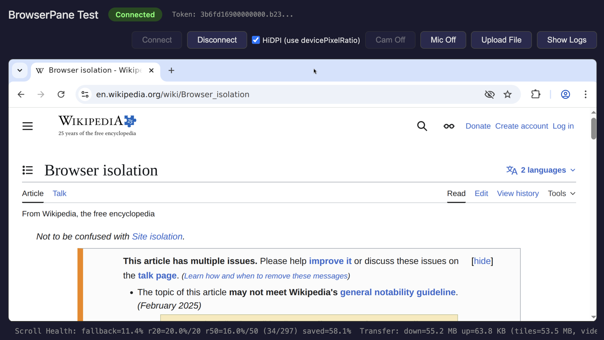

# BrowserPane

BrowserPane is a browser-native remote browser/desktop stack for a Linux host container.

It runs a real Chromium session inside a Linux environment, captures that surface on the host, transports it over WebTransport, and renders it in a browser client with a tile-first pipeline plus optional ROI H.264 video for media-heavy regions.



## Current Status

BrowserPane is still experimental.

Current support and scope:

- Host runtime: Linux only. Ubuntu 24.04 container is the primary target.
- Browser runtime: Chromium desktop only. Firefox and Safari are not production targets.
- Shared sessions: collaborative by default, intended for small curated groups rather than broadcast-scale delivery.
- Owner/viewer mode: optional exclusive-owner mode is supported in the gateway; restricted viewers are read-only.
- Camera: disabled by default in the compose stack and requires browser H.264 encode support plus a mapped `v4l2loopback` device.

## How The System Is Shaped

At a high level, BrowserPane has five responsibilities:

1. Run a real browser session in a Linux host environment.
2. Capture and classify that surface efficiently.
3. Transport state, input, and media between host and browser.
4. Render the remote session in a regular web page.
5. Coordinate shared-session policy and automation ownership.

The default local runtime looks like this:

```text
browser client <-> bpane-gateway <-> bpane-host <-> Chromium inside Linux container
                       |
                       +-> mcp-bridge
```

## Projects And Responsibilities

| Project | Responsibility |
| --- | --- |
| `code/apps/bpane-host` | Linux host agent. Captures the desktop surface, classifies tiles, drives ROI H.264 video, emits audio, injects input, and handles clipboard, file transfer, resize, and camera ingress plumbing. |
| `code/apps/bpane-gateway` | WebTransport entry point and shared-session coordinator. Relays frames between browser clients and the host, applies owner/viewer policy, and exposes the HTTP session/ownership API. |
| `code/shared/bpane-protocol` | Shared binary wire contract. Defines channels, frame envelopes, typed protocol messages, and incremental frame decoding used by the Rust services and validated against the browser client. |
| `code/web/bpane-client` | Real browser client. Renders tiles/video, decodes media, captures keyboard/mouse/clipboard input, and manages browser-side audio, camera, and file-transfer flows. |
| `code/integrations/mcp-bridge` | Automation bridge for MCP/Playwright-style control flows. Integrates with gateway ownership APIs so automation can drive a session while humans observe. |
| `deploy/` | Local runtime manifests and container images. This is the practical source of truth for how the dev stack is assembled and started. |

## Rendering Model

BrowserPane is not a simple full-frame video streamer.

- UI and text travel primarily over the reliable tile path.
- Media-heavy regions can move to ROI H.264 on the video path.
- Desktop audio travels separately from visual updates.
- Input, clipboard, file transfer, microphone, and camera each have dedicated protocol flows.

That split is what lets the system keep static UI sharp while still handling moving video efficiently.

## Protocol Model

The shared protocol is a compact binary protocol implemented in `bpane-protocol`.

- Reliable typed channels are used for control, input, cursor, clipboard, file transfer, and tiles.
- Raw media channels are used for video, desktop audio, microphone, and camera payloads.
- The protocol crate is the source of truth for frame/message definitions; the README stays intentionally high-level.

## Local Development

### Recommended: Docker Compose

Generate a dev certificate once:

```bash
./deploy/gen-dev-cert.sh dev/certs
```

Start the stack:

```bash
docker compose -f deploy/compose.yml up --build
```

Then open `http://localhost:8080` in Chromium.

The compose stack starts:

- `host`: Linux host runtime with Xorg dummy, Openbox, Chromium, and `bpane-host`
- `gateway`: WebTransport relay on `:4433` and HTTP API on `:8932`
- `web`: local frontend on `:8080`
- `mcp-bridge`: MCP bridge on `:8931`

For Chromium, WebTransport still needs trusted TLS on localhost. The SPKI fingerprint is written to:

```text
dev/certs/cert-fingerprint.txt
```

### Build And Test Without Running The Full Stack

Rust:

```bash
cargo build --workspace
cargo test --workspace
```

Browser client:

```bash
cd code/web/bpane-client
npm ci
npx tsc --noEmit
npm test
npm run build
```

Other useful checks:

```bash
cargo test -p bpane-protocol
cargo test -p bpane-host
cargo test -p bpane-gateway
cd code/integrations/mcp-bridge && npm run build
cd code/tests/e2e && npm test
```

## Shared Session Behavior

- Sessions are collaborative by default.
- If the gateway runs with exclusive browser ownership, one browser client is interactive and later clients become viewers.
- MCP ownership also forces browser clients into viewer behavior.
- Viewers are read-only and do not get interactive capabilities like input, clipboard, upload, download, microphone, camera, or resize.

## Documentation Policy

This README is intentionally responsibility-oriented and high level.

It should explain:

- what BrowserPane is
- what each project is responsible for
- what is currently supported
- how to run and validate the system

It should not try to mirror the exact file layout or every implementation detail. Those move too quickly and become stale.

When documentation disagrees with reality, prefer:

1. the code
2. runtime manifests and package scripts
3. `AGENTS.md`
4. this `README.md`
