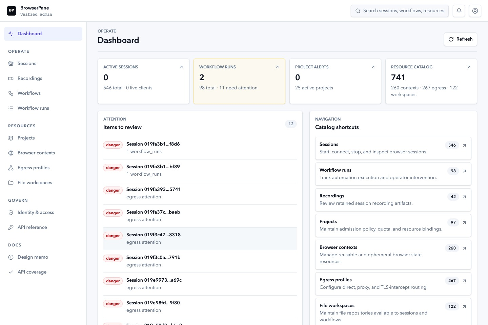
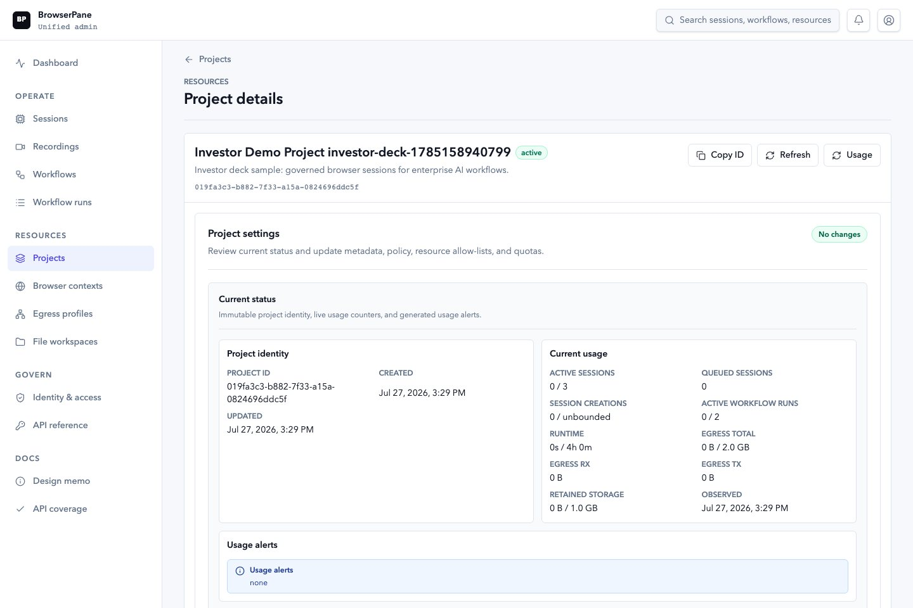
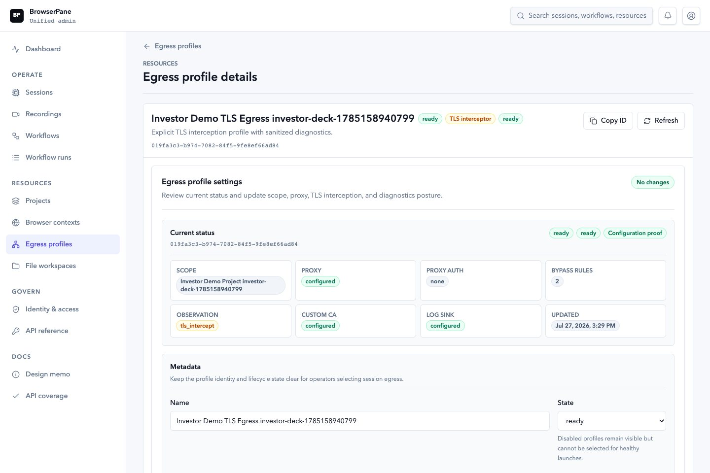
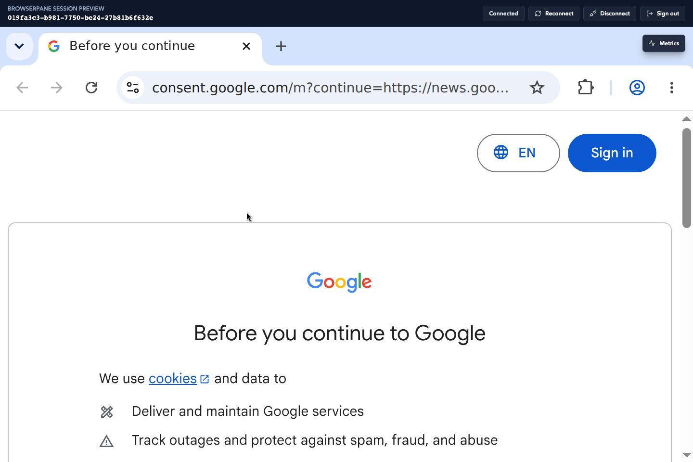
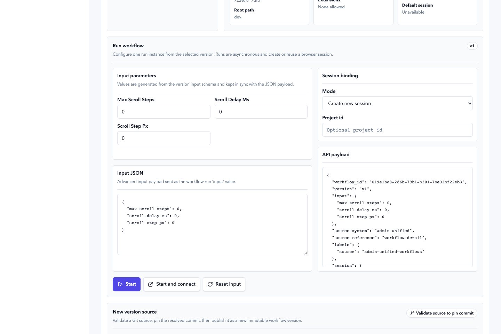
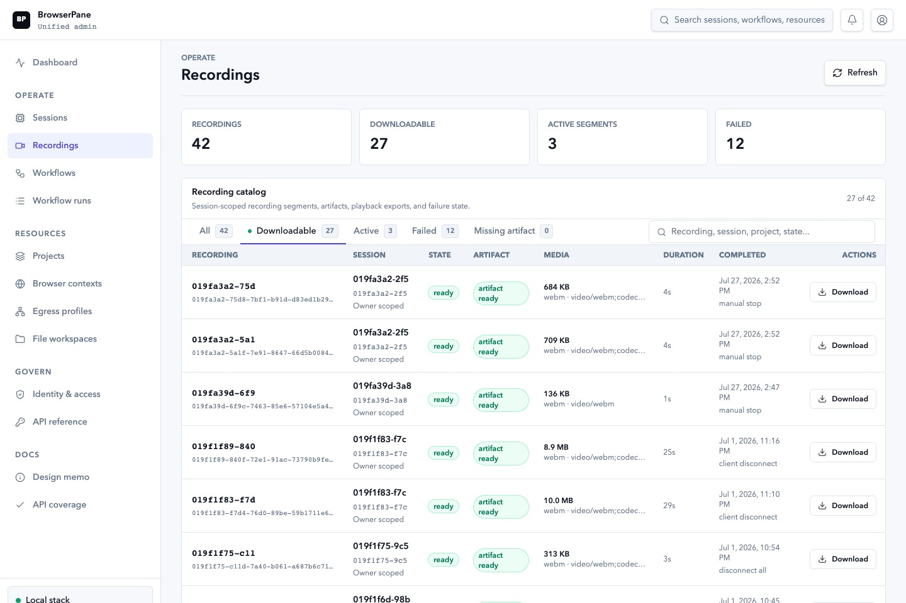

# BrowserPane

BrowserPane is a self-hostable remote browser and workflow execution platform for humans and agents.

Many browser automation products expose managed browsers, CDP endpoints, or live debug links. BrowserPane treats the live browser session itself as the product surface: a real Chromium session that browser users, supervisors, and automation can all attach to with shared-session policy, owner/viewer controls, and persistent session resources.

The key technical difference is that BrowserPane includes its own host-layer remote browser stack. The Rust `bpane-host` process runs next to Chromium inside the Linux runtime, captures and classifies the desktop surface, streams tiles, ROI video, audio, cursor, clipboard, files, input, microphone, camera, and resize events through BrowserPane's protocol, and lets the web client render the live session in a regular browser page.

BrowserPane is intended to be integrated into larger automation and workflow systems. Its workflow layer is primarily about browser-run execution, supervision, artifacts, and human intervention around a live browser session, not about replacing a general scheduler or DAG orchestrator.

This means BrowserPane is not only a wrapper around Playwright, CDP, screenshots, or a hosted debug iframe. It owns the live browser transport path from the Linux host to the browser client.

Project walkthrough: [watch on YouTube](https://www.youtube.com/watch?v=zhj2_B4vLMs).

## Unified Admin Console

BrowserPane is consolidating live session operation, resource configuration,
workflow execution, recordings, and project/egress governance in the
route-backed `/admin-new/` application. This is the target standard admin
experience. The legacy `/admin/` console remains available as a compatibility
fallback until the
[admin-new promotion gate in issue #163](https://github.com/ITmedes/browserpane/issues/163)
has verified the remaining route parity and regression coverage.

The current prototype includes the dashboard; project, browser-context,
egress-profile, and file-workspace catalogs; session create/detail and popup
preview flows; recording catalog/download; workflow source, version, and run
launching; workflow-run catalog/detail; identity/access review and registry
management; approved-extension, credential-binding, and workflow-event
subscription catalogs; and refresh-safe session live, files, recordings,
network, automation, policy, and observability routes. Contract-derived API,
coverage, and docs companions are implemented. Session-template and operation
counter catalogs remain open.
See the
[admin-new implementation status](docs/ADMIN_NEW_STATUS.md) for the maintained
route-level matrix.

<table>
  <tr>
    <td width="50%"><a href="assets/readme/browserpane-admin-new-dashboard.jpg"></a></td>
    <td width="50%"><a href="assets/readme/browserpane-admin-new-project-governance.jpg"></a></td>
  </tr>
  <tr>
    <td align="center"><sub>Operational dashboard and resource health</sub></td>
    <td align="center"><sub>Project policy, quota, usage, and resource bindings</sub></td>
  </tr>
  <tr>
    <td width="50%"><a href="assets/readme/browserpane-admin-new-egress-governance.jpg"></a></td>
    <td width="50%"><a href="assets/readme/browserpane-admin-new-session-live.jpg"></a></td>
  </tr>
  <tr>
    <td align="center"><sub>Egress profile, proxy, TLS interception, and status</sub></td>
    <td align="center"><sub>Live browser session with reconnect and metrics controls</sub></td>
  </tr>
  <tr>
    <td width="50%"><a href="assets/readme/browserpane-admin-new-workflow-launcher.jpg"></a></td>
    <td width="50%"><a href="assets/readme/browserpane-admin-new-recordings.jpg"></a></td>
  </tr>
  <tr>
    <td align="center"><sub>Typed workflow inputs, session binding, and API payload</sub></td>
    <td align="center"><sub>Recording catalog, artifact state, and downloads</sub></td>
  </tr>
</table>

These screenshots show the current `/admin-new/` prototype with local demo
data. The frozen owner-scoped v1 control-plane contract lives in
[openapi/bpane-control-v1.yaml](openapi/bpane-control-v1.yaml).

The unified console also provides three contract-derived integration surfaces:

- `/admin-new/api` presents task-oriented, copyable commands for common project,
  session, workflow-run, and file-workspace flows.
- `/admin-new/coverage` inventories all frozen operations by family,
  authentication domain, and UI/worker ownership.
- `/admin-new/docs` explains contract scope and keeps non-v1 compatibility
  surfaces separate from the frozen owner-scoped API.

These routes load the committed operation, classification, example, and
compatibility manifests published beside the OpenAPI document. They do not
store a bearer token or act as a generic in-browser API executor.

## Why BrowserPane

BrowserPane may fit when you need more than "a browser for an agent."

- BrowserPane owns the remote browser protocol. `bpane-host`, `bpane-gateway`, `bpane-protocol`, and `bpane-client` form a browser-native live session stack rather than delegating the user experience to a generic remote desktop product.
- Shared sessions are a first-class feature, not an afterthought. Multiple browser clients can join the same session with collaborative or restricted viewer behavior.
- Automation attaches to governed sessions instead of bypassing session policy. MCP and other automation flows operate through explicit ownership and session-control APIs.
- The remoting stack is browser-native. BrowserPane uses WebTransport plus a tile-first render path with optional ROI H.264 instead of relying only on full-frame streaming or vendor-hosted live debug UIs.
- The session behaves like a real remote workspace. Clipboard, file transfer, audio out, microphone in, camera ingress, resize, and input policy are part of the system design.
- The platform is self-hostable. Teams can run BrowserPane in their own environment instead of treating browser control as a SaaS-only dependency.

## Where It Fits

BrowserPane is a strong fit for:

- human-in-the-loop browser automation
- collaborative investigation, support, or review sessions
- regulated or private deployments that need self-hosted browser access
- workflow systems that need durable session identity, artifacts, logs, and audit history
- platforms that need a governed browser execution target inside a larger orchestration stack

## Current Status

BrowserPane is still experimental.

Use the [capability maturity matrix](docs/CAPABILITY_MATURITY_MATRIX.md) for
evidence-backed status and the
[product phases and release gates](docs/PRODUCT_PHASES_AND_RELEASE_GATES.md)
for Foundation, Phase 0, Phase 1, Production, and Phase N claim boundaries. A
working local flow is Prototype evidence; it is not by itself a
Production-readiness claim.

Current support and scope:

- Host runtime: Linux only. Ubuntu 24.04 container is the primary target.
- Browser runtime: Chromium desktop only. Firefox and Safari are not production targets.
- Shared sessions: collaborative by default, intended for small curated groups rather than broadcast-scale delivery.
- Owner/viewer mode: optional exclusive-owner mode is supported in the gateway; restricted viewers are read-only.
- Camera: disabled by default in the compose stack and requires browser H.264 encode support plus a mapped `v4l2loopback` device.
- Control plane: owner-scoped v1 APIs now cover identity/access-review summaries, service principals, identity-to-project mappings, projects, sessions, session templates, egress profiles, automation tasks, session recordings, workflow definitions/runs, file workspaces, credential bindings, and approved extensions.
- Workflow execution: Git-backed workflow versions run through a gateway-managed `workflow-worker`; the current executor model is Playwright.
- Admin console: `/admin-new/` is the target standard operator application. Its
  first-pass dashboard, primary resource catalogs, session creation/detail and
  popup preview, recording catalog/download, workflow launcher, workflow-run
  catalog/detail, identity/access review, and session
  live/files/recordings/network/automation/policy/observability routes are
  implemented. Contract-derived API, coverage, and docs companions are also
  implemented, together with approved-extension, credential-binding, and signed
  workflow-event subscription catalogs. Session-template and operation-counter
  catalogs remain open; `/admin/` remains
  the compatibility fallback until
  [issue #163](https://github.com/ITmedes/browserpane/issues/163) completes the
  promotion and rollback gate.
- Workflow boundary: BrowserPane currently focuses on executing and supervising browser workflows. Broader scheduling, DAG orchestration, and cross-system coordination are expected to sit above BrowserPane rather than inside it.
- External BPM integration: the stable project-scoped Workflow Endpoint is
  planned under [issue #172](https://github.com/ITmedes/browserpane/issues/172);
  the existing owner-scoped workflow-run API is not that production contract.
- Teach Mode: prose/demonstration-to-workflow authoring and controlled repair
  are planned under [issue #171](https://github.com/ITmedes/browserpane/issues/171)
  and are not current capabilities.
- Remote protocol: the integrated BrowserPane protocol is implemented, while
  its public specification, version negotiation, conformance, fuzzing, and
  compatibility policy remain planned under
  [issue #175](https://github.com/ITmedes/browserpane/issues/175).

## How The System Is Shaped

At a high level, BrowserPane has five responsibilities:

1. Run a real browser session in a Linux host environment.
2. Capture and classify that surface efficiently.
3. Transport state, input, and media between host and browser.
4. Render the remote session in a regular web page.
5. Coordinate durable control-plane resources for identity, projects, sessions,
   workflows, recordings, files, credentials, extensions, and automation
   ownership.

The default local runtime looks like this:

```text
browser client
  <-> bpane-gateway
  <-> bpane-host
  <-> Chromium + Xorg/Openbox inside a Linux runtime

bpane-host captures the browser desktop surface and emits BrowserPane protocol frames.
bpane-gateway applies session policy and relays WebTransport traffic.
bpane-client renders the live session and sends input/media/file events back.

bpane-gateway also talks to:
  - postgres
  - mcp-bridge
  - workflow-worker
  - recording-worker
```

## Projects And Responsibilities

| Project | Responsibility |
| --- | --- |
| `code/apps/bpane-host` | Linux host agent. Captures the desktop surface, classifies tiles, drives ROI H.264 video, emits audio, injects input, and handles clipboard, file transfer, resize, and camera ingress plumbing. |
| `code/apps/bpane-gateway` | WebTransport entry point, shared-session coordinator, runtime lifecycle boundary, and control-plane API for identity/access review, projects, sessions, templates, browser contexts, egress, automation tasks, recordings, workflows, files, credentials, and extensions. |
| `code/shared/bpane-protocol` | Rust implementation of the binary wire contract. Defines channels, frame envelopes, typed protocol messages, and incremental frame decoding; the TypeScript client maintains the corresponding browser-side codec. |
| `code/web/bpane-client` | Real browser client. Renders tiles/video, decodes media, captures keyboard/mouse/clipboard input, and manages browser-side audio, camera, and file-transfer flows. |
| `code/integrations/mcp-bridge` | Automation bridge for MCP/Playwright-style control flows. Exposes compatibility Streamable HTTP on `/mcp`, session-scoped Streamable HTTP on `/sessions/{id}/mcp`, compatibility SSE on `/sse`, session-scoped SSE on `/sessions/{id}/sse`, and integrates with gateway ownership APIs so automation can attach alongside interactive browser users through delegated session control. |
| `code/integrations/workflow-worker` | On-demand workflow executor. Downloads pinned workflow source snapshots, attaches with session automation access, runs Playwright workflow entrypoints, resolves credential/workspace inputs, and writes logs, outputs, and produced files back to the gateway. |
| `code/integrations/recording-worker` | On-demand recording executor. Attaches as a passive recorder client, captures WebM output, and finalizes recording metadata into gateway-managed artifact storage. |
| `deploy/` | Local runtime manifests and container images. This is the practical source of truth for how the dev stack is assembled and started. |

## Rendering Model

BrowserPane is not a simple full-frame video streamer.

- UI and text travel primarily over the reliable tile path.
- Media-heavy regions can move to ROI H.264 on the video path.
- Desktop audio travels separately from visual updates.
- Input, clipboard, file transfer, microphone, and camera each have dedicated protocol flows.

That split is what lets the system keep static UI sharp while still handling moving video efficiently.

## Protocol Model

The BrowserPane wire contract is a compact binary protocol implemented by the
Rust `bpane-protocol` crate and the corresponding TypeScript client codec.

- Reliable typed channels are used for control, input, cursor, clipboard, file transfer, and tiles.
- Raw media channels are used for video, desktop audio, microphone, and camera payloads.
- The interoperating Rust and TypeScript implementations are the current code-level contract. A language-neutral public specification, explicit version negotiation, and conformance suite remain planned in [issue #175](https://github.com/ITmedes/browserpane/issues/175).

## Local Development

### Recommended: Docker Compose

The local stack defaults to `docker_pool` mode. Creating a session persists its
control-plane resource; opening its preview starts or reconnects the isolated
browser runtime when needed.

Generate a dev certificate once:

```bash
./deploy/gen-dev-cert.sh dev/certs
```

Start the stack:

```bash
BPANE_GATEWAY_MAX_ACTIVE_RUNTIMES=2 \
docker compose -f deploy/compose.yml up --build
```

Then open `http://localhost:8080/admin-new/` in Chromium to use the target
unified admin console. The web root currently continues to redirect to
`/admin/`, which remains the compatibility fallback until issue #163 completes
the promotion gate.

The unified session preview popup includes a local `Metrics` drawer that can
sample browser transition diagnostics from the BrowserPane client runtime
without creating a backend artifact. It reports FPS, transfer rates, tile mix,
cache health, scroll fallback health, video datagrams, and render backend, and
can copy the current sample as JSON for debugging.

The unified admin redirects unauthenticated users to the local Keycloak login.
Use these development credentials:

- username: `demo`
- password: `demo-demo`

Then:

1. Open `Sessions`, choose `New session`, configure the resource, and click `Create session`. Creation does not start a browser runtime.
2. Open the session `Live` area to inspect runtime/connection state, then choose `Connect` or `Start and connect`. The browser opens in a separate popup window.
3. Open the session `Files` area to inspect retained uploads/downloads and manage policy-approved workspace bindings.
4. Open the same session detail and preview from another signed-in browser window to test collaborative access.
5. In `MCP Delegation`, choose `Authorize` and, for compatibility clients, `Set default` when the local `mcp-bridge` should drive that session.
6. For external MCP clients, prefer the session-scoped URL shown in the MCP panel, for example `http://localhost:8931/sessions/{session_id}/mcp`.

If you explicitly want the older single-runtime compatibility stack, opt into it:

```bash
BPANE_GATEWAY_RUNTIME_BACKEND=static_single \
docker compose -f deploy/compose.yml up --build
```

The compose stack starts:

- `host`: Linux host runtime with Xorg dummy, Openbox, Chromium, and `bpane-host`
- `gateway`: WebTransport relay on `:4433` and HTTP APIs on `:8932`
- `postgres`: session-control database on `:5433`
- `vault`: local HashiCorp Vault dev server on `:8200` for workflow credential bindings
- `keycloak`: local OIDC provider on `:8091`
- `web`: local frontend on `:8080`
- `mcp-bridge`: MCP bridge on `:8931` (`/sessions/{id}/mcp` for recommended session-scoped Streamable HTTP, `/sessions/{id}/sse` for session-scoped legacy SSE, `/mcp` and `/sse` for compatibility)
- `recording-worker-image`: one-shot build helper for the on-demand recording worker image used by `recording.mode=always`; the gateway launches short-lived recorder containers when sessions start recording

The gateway exposes unauthenticated, resource-free operational probes on its
HTTP port:

```bash
curl -fsS http://localhost:8932/healthz
curl -fsS http://localhost:8932/readyz
```

`/healthz` reports process liveness. `/readyz` admits traffic only while the
gateway is running and its configured session store, runtime manager,
credential provider, and recording/workspace artifact stores are reachable.
Compose uses `/readyz` for the gateway health check. On SIGINT or SIGTERM the
gateway first withdraws readiness, rejects new API and WebTransport work, keeps
the probes visible for a short grace period, and then drains owned in-flight
work up to a bounded timeout. The local defaults can be overridden with
`BPANE_GATEWAY_READINESS_CHECK_TIMEOUT_SECS`,
`BPANE_GATEWAY_SHUTDOWN_READINESS_GRACE_SECS`, and
`BPANE_GATEWAY_SHUTDOWN_DRAIN_TIMEOUT_SECS`.

The gateway launches workflow-worker and recording-worker containers as
short-lived jobs; do not run them as long-lived services. The default compose
startup builds the `recording-worker-image` helper. Before local workflow runs
or workflow smokes, build the profile-gated workflow-worker image once:

```bash
docker compose -f deploy/compose.yml --profile workflow build workflow-worker
```

Rebuild that image after changing `code/integrations/workflow-worker` or its
container definition.

The gateway mounts the repository at `/workspace:ro` for local git-backed workflow sources and passes `--workflow-source-trusted-local-root /workspace`. The source resolver rejects local paths outside that explicit development root and gives Git short-lived, repository-scoped `safe.directory` entries only for each validated local source.
The recording worker uses the generated local SPKI fingerprint from `dev/certs/cert-fingerprint.txt` through the gateway's `--recording-worker-cert-spki-file` setting, so run `./deploy/gen-dev-cert.sh dev/certs` before starting compose after certificate rotations.
The recording worker forces the SDK render backend to Canvas2D for reliable headless Docker capture. Interactive admin and embedded browser clients keep the default `auto` backend, so GPU/WebGL rendering remains available for end-user sessions when the browser environment supports it.

The local MCP bridge uses the package-installed `@playwright/mcp` executable from its own dependencies. It should not download `@playwright/mcp@latest` on first connect; run `npm ci` in `code/integrations/mcp-bridge` or rebuild the image if that local executable is missing.

The gateway supports three runtime backends:

- `static_single`: one shared host worker
- `docker_single`: one start-on-demand runtime container with idle shutdown
- `docker_pool`: multiple start-on-demand runtime containers with explicit `max_active_runtimes` and `max_starting_runtimes`

`deploy/compose.yml` now defaults to `docker_pool`, but you can still switch backends explicitly when you need a compatibility check:

```bash
BPANE_GATEWAY_RUNTIME_BACKEND=docker_pool \
BPANE_GATEWAY_MAX_ACTIVE_RUNTIMES=2 \
docker compose -f deploy/compose.yml up --build
```

`deploy/compose.yml` now mounts Docker access into the gateway and forwards a shared host-worker env profile automatically. If your compose project name is not the default `deploy`, override these defaults too:

- `BPANE_GATEWAY_DOCKER_RUNTIME_IMAGE`
- `BPANE_GATEWAY_DOCKER_RUNTIME_NETWORK`
- `BPANE_GATEWAY_DOCKER_RUNTIME_SOCKET_VOLUME`
- `BPANE_GATEWAY_DOCKER_RUNTIME_SESSION_DATA_VOLUME_PREFIX`
- `BPANE_RECORDING_WORKER_NETWORK`
- `BPANE_RECORDING_WORKER_OUTPUT_VOLUME`
- `BPANE_RECORDING_WORKER_IMAGE`

The default local auth and session flow is OIDC-based:

- opening `/admin-new/` automatically redirects unauthenticated users to the
  local Keycloak realm; there is no separate landing-page login action
- the session creation form can bind a project, session template, reusable
  browser context, egress profile, capabilities, recording policy, labels,
  network identity, viewport, and optional idle timeout before persistence
- creating a session does not start its runtime; `Connect` or
  `Start and connect` opens the separate preview and starts/reconnects that
  exact session resource
- when a session omits `idle_timeout_sec`, local compose uses the gateway's
  300-second runtime idle-stop default
- reconnecting a stopped or released session reuses the same session resource;
  after a runtime stop it restores from the persisted Chromium profile rather
  than a suspended process image
- Docker-backed sessions keep Chromium profile, upload, and download data in
  session-specific storage, and runtime assignments are persisted in Postgres
  for gateway restart reconciliation
- the session detail view shows MCP authorization/default-session state and the
  immutable session-scoped endpoint for direct MCP clients

The admin consoles fetch `/auth-config.json` and use the shared
`@browserpane/admin-auth` package for Authorization Code + PKCE. Its
provider-neutral protocol core is `oauth4webapi`; BrowserPane only owns runtime
configuration, the bounded login transaction, auth snapshots, redirects, and
application recovery. Access, ID, and refresh tokens stay in memory. Only the
short-lived PKCE verifier, state, nonce, redirect URI, and creation time enter
per-tab `sessionStorage`; reloading performs a normal OIDC redirect and normally
recovers through the existing provider SSO session.
Before WebTransport connect, the console mints a short-lived session-scoped connect ticket from the session API and uses that ticket on the transport URL instead of the long-lived bearer token. The legacy development harness remains available at `/test-embed.html` for smoke tests that still exercise harness-specific hooks.

For Chromium, WebTransport still needs trusted TLS on localhost. The current runtime SPKI fingerprint is served at:

```text
http://localhost:8080/cert-fingerprint
http://localhost:8080/cert-hash
```

`./deploy/gen-dev-cert.sh dev/certs` also refreshes `dev/certs/cert-fingerprint.txt` and `dev/certs/cert-hash.txt` from the same `cert.pem` for CLI and WebTransport certificate-hash use. The admin app and browser client request these local certificate metadata endpoints without browser cache reuse so certificate rotations can be picked up after reload.

If a manually launched local Chromium reports `Opening handshake failed` when joining a session, start it with the local QUIC origin and SPKI trust flags:

```bash
/Applications/Google\ Chrome.app/Contents/MacOS/Google\ Chrome \
  --origin-to-force-quic-on=localhost:4433 \
  --ignore-certificate-errors-spki-list="$(cat dev/certs/cert-fingerprint.txt)" \
  http://localhost:8080/admin-new/
```

### Remote / Self-Hosted Testing

The checked-in compose stack is a local development and regression environment,
not a production deployment guide. Remote testing needs HTTPS for the web UI,
a browser-trusted WebTransport gateway certificate, aligned OIDC issuer and
redirect settings, and private handling for dev-only services such as Postgres,
Vault, Keycloak admin surfaces, gateway internals, and the MCP bridge.

See [REMOTE_DEPLOYMENT.md](REMOTE_DEPLOYMENT.md) for the current remote
deployment assumptions and compose override notes.

## Control Plane

`bpane-gateway` exposes the frozen v1 control-plane contract used by the admin
applications, CLI, integrations, and workers.

Canonical contract:

- [openapi/bpane-control-v1.yaml](openapi/bpane-control-v1.yaml)
- [control API compatibility policy](docs/CONTROL_API_COMPATIBILITY_POLICY.md)

Selected resource and diagnostics routes:

- `POST /api/v1/sessions`
- `GET /api/v1/sessions`
- `GET /api/v1/sessions/{id}`
- `DELETE /api/v1/sessions/{id}`
- `GET /api/v1/identity/me`
- `GET /api/v1/identity/access-review`
- `POST /api/v1/service-principals`
- `GET /api/v1/service-principals`
- `GET /api/v1/service-principals/{id}`
- `PUT /api/v1/service-principals/{id}`
- `POST /api/v1/identity-mappings`
- `GET /api/v1/identity-mappings`
- `GET /api/v1/identity-mappings/{id}`
- `PUT /api/v1/identity-mappings/{id}`
- `POST /api/v1/browser-contexts`
- `GET /api/v1/browser-contexts`
- `GET /api/v1/browser-contexts/{id}`
- `POST /api/v1/browser-contexts/{id}/clone`
- `GET /api/v1/browser-contexts/{id}/export`
- `POST /api/v1/browser-contexts/import`
- `DELETE /api/v1/browser-contexts/{id}`
- `POST /api/v1/session-templates`
- `GET /api/v1/session-templates`
- `GET /api/v1/session-templates/{id}`
- `PUT /api/v1/session-templates/{id}`
- `POST /api/v1/projects`
- `GET /api/v1/projects`
- `GET /api/v1/projects/{id}`
- `PUT /api/v1/projects/{id}`
- `GET /api/v1/projects/{id}/usage`
- `POST /api/v1/egress-profiles`
- `GET /api/v1/egress-profiles`
- `GET /api/v1/egress-profiles/{id}`
- `PUT /api/v1/egress-profiles/{id}`
- `GET /api/v1/egress-profiles/{id}/diagnostics`
- `GET /api/v1/sessions/{id}/egress-diagnostics`
- `POST /api/v1/sessions/{id}/egress-diagnostics`
- `POST /api/v1/sessions/{id}/egress-usage`

Owner-facing resources are bearer-protected, owner-scoped, and stored in
Postgres. Explicit worker, recorder, bridge, and observer operations use the
narrower bearer or session-automation credentials defined per operation. The
OpenAPI file is canonical; the route lists below are selected local-development
surfaces, not an exhaustive duplicate of the contract.

### Resources And Policy

- **Session templates** provide reusable defaults for ownership, viewport,
  timeout, labels, network identity, and recording. Explicit session fields
  override template defaults.
- **Projects** group sessions and workflow runs under a customer, case, tenant,
  or environment boundary. They define resource allow-lists, transfer and
  recording policy, concurrency limits, usage budgets, and retained-storage
  quotas.
- **File workspaces, credential bindings, and approved extensions** provide
  governed inputs without embedding file paths, secrets, or extension payloads
  in session and workflow definitions.
- **Identity and access-review resources** expose the current principal,
  registered service principals, and explicit identity-to-project mappings
  without returning raw bearer-token payloads. Disabled service principals
  cannot receive new automation delegation. These operations are available
  through the API, CLI, and `/admin-new/identity`. The unified route supports
  service-principal and identity-mapping create, edit, disable, and re-enable
  while keeping registry metadata distinct from enforced RBAC grants.
- **Network identity and egress profiles** define locale, timezone, browser
  identity, proxy routing, proxy authentication, and optional custom CA policy.
  Project-scoped profiles and credentials cannot cross project boundaries.
- **Browser contexts** preserve reusable Chromium profile state independently
  from session-scoped uploads, downloads, and file bindings. A reusable context
  permits one active runtime writer, can enforce retention and storage limits,
  and project-owned contexts cannot cross project boundaries.

Project policy is enforced before runtime launch. Work that exceeds an active
capacity limit remains visible as queued and can be promoted when capacity
opens. Disallowed resource bindings are rejected, retained-storage limits block
new artifacts, and budget enforcement can block new session creation without
stopping sessions that are already running.

BrowserPane keeps egress evidence sanitized: it stores effective configuration,
runtime correlation, probe results, and reported byte totals. Requested URLs,
headers, payloads, credentials, CA material, and decrypted traffic remain with
the configured proxy or secure web gateway. TLS interception is opt-in and
requires a proxy, custom CA, and approved sensitive-log sink.

The unified admin supports context catalog, create, detail, delete, clone,
export, and import flows. Clone and export expose active-writer blockers before
submission, while import preserves the selected archive and metadata after
bounded validation or capacity errors so the operator can correct or retry.
The API, CLI, compatibility console, and unified admin use the same lifecycle
contract tracked in
[issue #160](https://github.com/ITmedes/browserpane/issues/160).

### Session Runtime And Delegation

The gateway also exposes an owner-scoped realtime WebSocket for snapshot
updates:

- `POST /api/v1/admin/events/access-tokens`
- `GET /api/v1/admin/events`

The browser mints a short-lived `admin_event_access_token` through the
bearer-authenticated POST, opens the WebSocket without URL credentials, and
sends the scoped token in its first message. Each reconnect mints a fresh
token. Both admin consoles consume the same validated event contract and
reconnect behavior. `/admin-new/sessions/{id}/observability` projects the
owner-scoped snapshots into current session evidence and a bounded local
timeline; it is operational context, not a durable audit log. The adjacent
`/automation` and `/policy` routes expose session-bound MCP/workflow
associations and effective restriction evidence.

The same frozen API surface also includes session-scoped runtime routes:

- `POST /api/v1/sessions/{id}/access-tokens`
- `POST /api/v1/sessions/{id}/automation-access`
- `GET /api/v1/sessions/{id}/status`
- `POST /api/v1/sessions/{id}/stop`
- `POST /api/v1/sessions/{id}/release`
- `POST /api/v1/sessions/{id}/kill`
- `POST /api/v1/sessions/{id}/connections/{connection_id}/disconnect`
- `POST /api/v1/sessions/{id}/connections/disconnect-all`
- `POST /api/v1/sessions/{id}/mcp-owner`
- `DELETE /api/v1/sessions/{id}/mcp-owner`
- `POST /api/v1/sessions/{id}/automation-owner`
- `DELETE /api/v1/sessions/{id}/automation-owner`

Session-scoped file binding routes let owners attach existing workspace files
to a session-level mount contract and let owners or automation read those bound
resources through the API:

- `POST /api/v1/sessions/{id}/file-bindings`
- `GET /api/v1/sessions/{id}/file-bindings`
- `GET /api/v1/sessions/{id}/file-bindings/{binding_id}`
- `GET /api/v1/sessions/{id}/file-bindings/{binding_id}/content`
- `DELETE /api/v1/sessions/{id}/file-bindings/{binding_id}`
- `GET /api/v1/sessions/{id}/files`
- `GET /api/v1/sessions/{id}/files/{file_id}`
- `GET /api/v1/sessions/{id}/files/{file_id}/content`

Bindings snapshot workspace-file metadata, enforce relative mount paths, reject
duplicate active mount paths per session, and allow session automation access to
read/list bound file resources. The file-inspection/download APIs are available
today; browser-container mount materialization is a separate runtime concern.
For project sessions, `allow_session_file_bindings=false` rejects new
session-file bindings. `allow_browser_uploads=false` and
`allow_browser_downloads=false` reject live browser transfer sources from the
corresponding direction and surface the session as file-transfer restricted.

Session resources and status responses now expose a richer lifecycle model:

- persisted `state`
- derived `runtime_state`
- derived `runtime_resume_mode`
- derived `presence_state`
- `connection_counts` by role
- live `connections` descriptors on the status route
- `stop_eligibility` with blocker details
- idle timing metadata
- `runtime_released_at` and `stopped_at` timestamps
- side-effect-free status snapshots, including for stopped sessions

Lifecycle control semantics are now explicit:

- `DELETE /api/v1/sessions/{id}` follows safe-stop semantics
- `POST /api/v1/sessions/{id}/stop` stops only when no blockers remain
- `POST /api/v1/sessions/{id}/release` releases the live runtime while preserving the session resource and profile
- `POST /api/v1/sessions/{id}/kill` force-terminates live attachments and releases the runtime
- connection-level disconnect routes remove live attachments without stopping the session runtime

The local development flow uses those routes to bridge browser-owned and
automation-owned control:

- `/admin-new/` creates an explicit owner-scoped session resource before any
  browser connect; opening a preview never creates a different session
- it then mints a short-lived `session_connect_ticket` from `POST /api/v1/sessions/{id}/access-tokens`
- the gateway routes the WebTransport connect through that explicit session id instead of one global token path
- `Authorize` assigns that session to the local `bpane-mcp-bridge` service
  principal; `Set default` then calls the authenticated gateway proxy at
  `/api/v1/mcp-bridge/control-session`; the gateway validates the owner/session
  and forwards the request to `mcp-bridge` with its internal control bearer
  token so the bridge adopts that same session for later ownership/status calls
- external MCP clients can avoid the mutable bridge control target by connecting
  directly to `:8931/sessions/{session_id}/mcp` after that session is delegated
- direct `:8931/control-session` remains a bridge-local compatibility control
  target. In local compose it is bearer-protected and intended for gateway
  proxying/internal smokes, not browser frontend calls.
- the local `mcp-bridge` now resolves the managed session's runtime CDP endpoint from the session resource, so delegated control also works in `docker_pool` mode

MCP delegation terminology:

- gateway delegation: the owner grants the `bpane-mcp-bridge` service principal
  access to a session through `POST /api/v1/sessions/{id}/automation-owner`
- bridge-adopted session: the compatibility `/control-session` pointer targets
  that session
- MCP-owned session: the bridge has claimed session-scoped `/mcp-owner` while
  at least one MCP client is active
- connected MCP client: one streamable HTTP or SSE MCP transport is bound to a
  bridge target; with `/sessions/{id}/mcp` that target is immutable for the
  connection lifetime

### Operator CLI

Supported local operator CLI:

- Repo-level wrapper: `./scripts/bpane <command>`
- Package entrypoint: `cd code/web/bpane-client && npm run bpane:cli -- <command>`
- Installable package binary name: `bpane`
- Configuration precedence: command flags, environment variables, selected
  profile, then local defaults
- Local profile path: `~/.config/bpane/config.json`, override with
  `BPANE_CONFIG` or `--config`
- Profile selection: `BPANE_PROFILE` or `--profile`
- Gateway URL source: `BPANE_BASE_URL`, `BPANE_API_URL`, `--base-url`, or
  `--api-url`
- Bearer token source: `BPANE_ACCESS_TOKEN`, `--access-token`, or `--token`
- Profile files are written with `0600` permissions; access tokens are only
  persisted when `profile init` is run with `--save-token`
- Successful responses and CLI errors are emitted as structured JSON; unknown
  options fail as usage errors instead of being ignored

Minimal local operator setup:

```bash
export BPANE_ACCESS_TOKEN=<owner bearer token>
./scripts/bpane profile init local \
  --base-url http://localhost:8080 \
  --mcp-control-url http://localhost:8080/api/v1/mcp-bridge/control-session \
  --mcp-endpoint-base-url http://localhost:8931 \
  --set-default
```

Common session operations:

```bash
./scripts/bpane session list
./scripts/bpane session list --state stopped --label suite=smoke --limit 5
./scripts/bpane session list --template-id <template-id> --label team=support
./scripts/bpane session create --label purpose=manual-test
./scripts/bpane session create --project-id <project-id> --label purpose=tenant-test
./scripts/bpane session create --browser-context-id <context-id> --label purpose=context-test
./scripts/bpane session create \
  --locale de-DE \
  --language de-DE \
  --language en-US \
  --timezone Europe/Berlin \
  --egress-profile-id <egress-profile-id> \
  --label purpose=regional-test
./scripts/bpane session get <session-id>
./scripts/bpane session status <session-id>
./scripts/bpane session access-token <session-id>
./scripts/bpane session automation-access <session-id>
./scripts/bpane session disconnect-all <session-id>
./scripts/bpane session stop <session-id>
./scripts/bpane session kill <session-id>
```

Common identity and access-review operations:

```bash
./scripts/bpane identity me
./scripts/bpane identity access-review
./scripts/bpane service-principal create "MCP bridge" \
  --client-id bpane-mcp-bridge \
  --issuer http://localhost:8091/realms/browserpane-dev \
  --scope session:delegate
./scripts/bpane service-principal list
./scripts/bpane service-principal get <service-principal-id>
./scripts/bpane service-principal update <service-principal-id> --state active
./scripts/bpane service-principal disable <service-principal-id>
./scripts/bpane identity-mapping create "Support team user" \
  --kind user \
  --issuer http://localhost:8091/realms/browserpane-dev \
  --external-id <external-user-subject> \
  --project-id <project-id>
./scripts/bpane identity-mapping list
./scripts/bpane identity-mapping get <identity-mapping-id>
./scripts/bpane identity-mapping update <identity-mapping-id> --state active
./scripts/bpane identity-mapping disable <identity-mapping-id>
```

Common session-template operations:

```bash
./scripts/bpane session-template create customer-debug-session \
  --description "Support debug sessions" \
  --label team=support \
  --default-label purpose=debug \
  --owner-mode collaborative \
  --idle-timeout-sec 1800 \
  --recording-mode manual
./scripts/bpane session-template list
./scripts/bpane session-template get <template-id>
./scripts/bpane session-template update <template-id> --name customer-debug-session --default-label purpose=debug
./scripts/bpane session create --template-id <template-id> --label case=INC-1234
```

Common project operations:

```bash
./scripts/bpane project create support-tenant \
  --description "Support tenant quota" \
  --label tenant=support \
  --max-active-sessions 3 \
  --max-active-workflow-runs 4 \
  --max-retained-storage-bytes 1073741824 \
  --max-session-creations 25 \
  --max-session-creations-per-window 10 \
  --session-creation-window-sec 3600 \
  --max-runtime-usage-ms 86400000 \
  --max-egress-total-bytes 10737418240 \
  --allow-browser-uploads true \
  --allow-browser-downloads true \
  --allow-session-file-bindings true \
  --allow-manual-recordings true \
  --usage-budget-enforcement warning_only
./scripts/bpane project list
./scripts/bpane project get <project-id>
./scripts/bpane project usage <project-id>
./scripts/bpane project update <project-id> --name support-tenant --max-active-sessions 5 --max-session-creations 50 --max-session-creations-per-window 10 --session-creation-window-sec 3600 --allow-session-file-bindings false --allow-manual-recordings false --usage-budget-enforcement block_session_creation
./scripts/bpane project update <project-id> \
  --allowed-session-template-id <template-id> \
  --allowed-egress-profile-id <egress-profile-id> \
  --allowed-extension-id <extension-id> \
  --allowed-browser-context-id <browser-context-id> \
  --allowed-file-workspace-id <workspace-id>
./scripts/bpane project archive <project-id>
./scripts/bpane session-template create tenant-debug-session --project-id <project-id> --default-label purpose=debug
```

Common egress-profile operations:

```bash
./scripts/bpane egress-profile create eu-support-egress \
  --description "Approved support outbound path" \
  --project-id <project-id> \
  --label region=eu \
  --proxy-url https://proxy.example:8443 \
  --proxy-credential-binding-id <credential-binding-id> \
  --bypass-rule localhost \
  --bypass-rule "*.internal.example" \
  --custom-ca-ref vault://pki/browserpane/eu-support \
  --custom-ca-name "EU support CA"
./scripts/bpane egress-profile list
./scripts/bpane egress-profile get <egress-profile-id>
./scripts/bpane egress-profile diagnostics <egress-profile-id>
./scripts/bpane egress-profile update <egress-profile-id> --name eu-support-egress-v2 --label managed=true
./scripts/bpane egress-profile disable <egress-profile-id>
./scripts/bpane session egress-diagnostics <session-id>
./scripts/bpane session egress-diagnostics probe <session-id>
./scripts/bpane session egress-usage report <session-id> \
  --rx-bytes-delta 4096 \
  --tx-bytes-delta 2048 \
  --egress-usage-source-kind proxy \
  --observer-id local-squid
```

Omit `--proxy-credential-binding-id` for proxies that do not require
authentication.

For a proxy that performs approved TLS interception, make that explicit and
name the sensitive-log sink:

```bash
./scripts/bpane egress-profile create inspected-support-egress \
  --proxy-url https://inspect-proxy.example:8443 \
  --custom-ca-ref file:///workspace/dev/egress-ca.pem \
  --custom-ca-name "Support inspection CA" \
  --traffic-observation-mode tls_intercept \
  --sensitive-log-sink-ref siem://browserpane/support-egress \
  --sensitive-log-sink-name "Support SIEM"
```

To observe egress traffic locally without changing the BrowserPane gateway,
start the normal compose stack first, then start the example forward proxies and
point an egress profile at one of them:

```bash
docker compose -f deploy/examples/egress-observer/compose.yml up --build
./scripts/bpane egress-profile create local-egress-observer \
  --proxy-url http://bpane-egress-observer:3128 \
  --bypass-rule localhost \
  --bypass-rule 127.0.0.1
deploy/examples/egress-observer/correlate-session-ip.sh
BPANE_ACCESS_TOKEN=<owner-token> \
  node deploy/examples/egress-observer/egress-usage-reporter.mjs \
  --since 10m \
  --dry-run
```

Tail the raw proxy logs in a separate terminal when you need URL/status/timing
debug evidence:

```bash
docker compose -f deploy/examples/egress-observer/compose.yml logs -f egress-proxy
```

The reporter reads the example Squid logs and BrowserPane docker runtime labels,
then calls `/api/v1/sessions/{id}/egress-usage` with sanitized byte deltas when
run without `--dry-run`. Dry-run output is sanitized and does not advance the
local watermark. BrowserPane does not receive proxy URLs, response status,
headers, timing, payload, credentials, CA material, or decrypted traffic. The
example Squid log format provides response/tunnel bytes, so the local reporter
maps that value to `rx_bytes_delta`; production collectors that need transmit
byte counters should calculate those in the proxy or secure-web-gateway layer
and call the same API.

The same compose file also starts an authenticated Squid fixture at
`bpane-egress-auth-observer:3130` with local test credentials
`proxy-user / proxy-pass`. Create a credential binding through the legacy
`/admin/` console or `POST /api/v1/credential-bindings`, attach its id with
`--proxy-credential-binding-id`, and run
`./scripts/bpane egress-profile diagnostics probe <egress-profile-id>` to prove
the proxy accepts the binding. Bad credentials or unavailable secret backends
surface as sanitized diagnostics instead of returning the secret value. A
unified credential-binding catalog remains open under
[issue #159](https://github.com/ITmedes/browserpane/issues/159).

For local HTTPS interception, run the mitmproxy-backed observer alongside the
plain Squid observer. If `dev/egress-ca.pem` and `dev/egress-ca.key` do not yet
exist, generate the local test CA first:

```bash
openssl req -x509 -newkey rsa:2048 -nodes -days 365 \
  -subj '/CN=BrowserPane Local Egress Test CA' \
  -keyout dev/egress-ca.key \
  -out dev/egress-ca.pem
docker compose -f deploy/examples/egress-observer/compose.yml up -d
deploy/examples/egress-observer/prepare-mitmproxy-ca.sh
docker compose -f deploy/examples/egress-observer/compose.tls.yml up -d
./scripts/bpane egress-profile create local-tls-observer \
  --proxy-url http://bpane-egress-tls-observer:3129 \
  --custom-ca-ref file:///workspace/dev/egress-ca.pem \
  --custom-ca-name "BrowserPane Local Egress Test CA" \
  --traffic-observation-mode tls_intercept \
  --sensitive-log-sink-ref siem://browserpane/local-egress \
  --sensitive-log-sink-name "Local Egress SIEM"
```

Sessions using that profile should show certificates issued by the local egress
CA in the remote Chromium certificate viewer. The TLS observer logs decrypted
request metadata and should only be used for local development or an approved
sensitive-log sink.

The target `/admin-new/egress` area lists stored profiles and provides create,
detail, edit, disable, and sanitized status views. It does not currently
bootstrap the legacy console's two localhost presets. For unified-admin tests,
create the plain-proxy and TLS-interceptor profiles through the route form, CLI,
or API before selecting them in a session.

Session diagnostics move from configuration proof to runtime launch metadata
once the selected profile has been applied to a live runtime, and to
active-probe proof after a probe succeeds. Profile and session probes are
currently API/CLI operations; run them only after the session runtime is ready.
Otherwise diagnostics record a sanitized `runtime not ready` failure instead
of launching a browser implicitly. Probe requests can supply `public_ip_url`,
`tls_probe_url`, and `timeout_ms`, or the matching CLI options
`--probe-public-ip-url`, `--probe-tls-url`, and `--probe-timeout-ms`.

```bash
cd code/web/bpane-client && npm run smoke:admin-egress-profiles -- --headless
cd code/web/bpane-client && npm run smoke:admin-unified-egress-profiles -- --headless
```

Common browser-context operations:

```bash
./scripts/bpane browser-context create support-profile --project-id <project-id> --label team=support --retention-sec 604800 --max-profile-storage-bytes 536870912
./scripts/bpane browser-context clone <context-id> support-profile-sandbox --project-id <project-id> --label copy=sandbox
./scripts/bpane browser-context export <context-id> --output support-profile.zip
./scripts/bpane browser-context import --input support-profile.zip --name support-profile-restored --project-id <project-id> --label restored=true
./scripts/bpane browser-context list
./scripts/bpane browser-context get <context-id>
./scripts/bpane browser-context delete <context-id>
cd code/web/bpane-client && npm run smoke:admin-browser-contexts -- --headless
cd code/web/bpane-client && npm run smoke:admin-unified-browser-contexts -- --headless
```

Browser-context imports authenticate before buffering, preflight the nested
profile archive, reject traversal/link/special-file entries, and return JSON
`413` for configured size/entry limits or `429` when import capacity is full.
Local compose defaults to a 512 MiB request/profile archive, a 2 GiB expanded
profile, 100,000 entries, and two concurrent imports. Override these with the
`BPANE_BROWSER_CONTEXT_IMPORT_*` compose variables shown in
`deploy/compose.yml` for intentionally larger environments.

File-workspace admin smoke coverage:

```bash
cd code/web/bpane-client && npm run smoke:admin-file-workspaces -- --headless
cd code/web/bpane-client && npm run smoke:admin-unified-file-workspaces -- --headless
```

MCP delegation and recovery operations:

```bash
./scripts/bpane mcp health
./scripts/bpane mcp authorize <session-id>
./scripts/bpane mcp set-default <session-id>
./scripts/bpane mcp doctor <session-id>
./scripts/bpane mcp preflight <session-id>
./scripts/bpane mcp repair <session-id>
./scripts/bpane mcp revoke <session-id>
./scripts/bpane mcp clear-default
```

Use `mcp repair <session-id>` when the intended session should be delegated to
the configured bridge client and selected as the bridge default target. It
applies the missing delegation/default-session changes and then reruns strict
diagnostics. Repair refuses to mutate delegation or the bridge default target
unless the session is visible to the current owner token. Use `session cleanup`
as a dry-run first, or pass `--dry-run` to force preview mode. Add `--confirm`
with at least one bounding `--label` or `--older-than-sec` filter for
destructive cleanup.

The operator CLI integration smoke is
`cd code/web/bpane-client && npm run smoke:bpane-cli -- --headless`. It logs in
through the legacy `/admin/` auth flow, creates a session, initializes a CLI
profile, exercises
identity/access-review, service-principal registry lifecycle, identity-mapping
lifecycle,
project/session-template/browser-context/egress catalog operations, session
access/status/diagnostics/disconnect/stop/kill/cleanup, and validates standalone
MCP health, authorize, set-default, doctor, preflight, repair, revoke, and
clear-default flows.

### Runtime Notes

Current runtime notes:

- the public session resource model is now versioned and persistent
- gateway transport and runtime compatibility APIs are now session-scoped
- gateway runtime orchestration now goes through an internal `SessionManager` boundary; the current runtime backend implementation still lives in `runtime_manager.rs`
- the default local compose runtime backend is `docker_pool`; the `legacy_single_runtime` compatibility mode remains available through `static_single` and `docker_single` checks
- the optional `docker_single` backend can now start and stop one runtime container for the active session
- the optional `docker_pool` backend can start multiple runtime containers in parallel, but only up to its configured runtime caps
- Docker-backed runtime assignment metadata is now persisted and reconciled on gateway startup so pool-mode workers can survive a gateway restart cleanly
- `mcp-bridge` keeps `/control-session` as a compatibility control target and
  supports recommended per-connection session routing through
  `/sessions/{session_id}/mcp` and `/sessions/{session_id}/sse`
- local compose routes browser/admin/CLI default-session mutations through the
  authenticated gateway proxy at `/api/v1/mcp-bridge/control-session`; direct
  bridge control on `:8931/control-session` is protected by the internal
  `BPANE_MCP_BRIDGE_CONTROL_TOKEN`
- `mcp-bridge` exposes `/health.managed_sessions` so multi-session clients can
  inspect each active control/session-bound target without relying only on the
  legacy `control_session_*` fields
- the default compose stack runs `docker_pool` for local multi-session testing
- global compatibility routes like `/api/session/status` and `/api/session/mcp-owner` are compatibility-only and are not part of the frozen v1 contract; multi-runtime backends should use session-scoped `/api/v1/sessions/{id}/...` routes

## Recordings

BrowserPane session recording is now a control-plane feature rather than only a browser-local blob download.

- Session recording policy supports `disabled`, `manual`, and `always`.
- Recording resources are session-scoped and persist segment metadata, runtime state, termination reason, and artifact linkage.
- Recordings can be inspected and downloaded from the global
  `/admin-new/recordings` catalog or the session-specific
  `/admin-new/sessions/{id}/recordings` route, as well as through the v1 API.
- Playback/export is modeled separately from raw recording segments, so multi-segment sessions stay explicit.
- Project policy can set `allow_manual_recordings=false` to block ad-hoc manual
  recording starts for project sessions. The unified admin session form uses
  `recording.mode=always` for automatic backend recording when the session
  runtime starts. The local compose stack wires this through a Docker-backed
  `recording-worker` image and a shared recording handoff volume. The API also
  supports manual recording resources, but `/admin-new/` does not currently
  expose manual Record/Stop controls.

Primary routes:

- `POST /api/v1/sessions/{id}/recordings`
- `GET /api/v1/sessions/{id}/recordings`
- `PUT /api/v1/sessions/{id}/recording-policy`
- `GET /api/v1/sessions/{id}/recordings/{recording_id}`
- `POST /api/v1/sessions/{id}/recordings/{recording_id}/stop`
- `GET /api/v1/sessions/{id}/recordings/{recording_id}/content`
- `GET /api/v1/sessions/{id}/recording-playback`
- `GET /api/v1/sessions/{id}/recording-playback/manifest`
- `GET /api/v1/sessions/{id}/recording-playback/export`

Local automatic backend recording flow:

1. Open `http://localhost:8080/admin-new/sessions`
2. Enable recording while creating the session, or enable the always-on policy
   from an existing session detail page. This does not start the runtime.
3. Choose `Connect` or `Start and connect`; the recording worker starts with the
   session runtime.
4. Disconnect the last interactive preview or use an applicable disconnect,
   release, stop, or kill action so the gateway finalizes the active segment.
5. Refresh `/admin-new/sessions/{id}/recordings` for policy, playback, and
   segment evidence. A single retained segment downloads as WebM, while a
   session with multiple retained segments downloads as a playback ZIP bundle.

## Workflow Platform

BrowserPane now exposes a first-class workflow execution layer on top of session automation access.

Current workflow capabilities:

- owner-scoped workflow definitions and immutable versions
- workflow runs with logs, events, outputs, recordings, and produced files
- workflow runs backed by persisted automation tasks with executor-visible
  state, event, and log APIs
- project-scoped workflow runs with inherited session projects, project
  summaries, and `max_active_workflow_runs` admission/queue visibility
- project retained-storage accounting/enforcement for workflow produced files,
  recording artifacts, session files, and project-owned file workspace files
- external correlation fields on runs (`source_system`, `source_reference`, `client_request_id`)
- safe idempotent run creation for retried upstream requests
- durable queued/admission state when BrowserPane worker capacity, project
  session quotas, or project workflow-run quotas are exhausted
- queued session controls expose queue position/age/blocker metadata and allow
  queued sessions to be cancelled before runtime admission
- durable operator intervention state with `submit-input`, `resume`, `reject`, and `cancel`
- explicit runtime hold/release semantics for paused runs (`live_runtime` vs `profile_restart`)
- signed outbound workflow lifecycle webhook delivery with URL, DNS/IP,
  redirect, and DNS-rebinding controls
- git-backed workflow sources pinned to resolved commits
- workflow source validation before immutable version creation, including entrypoint checks, bounded file listing, and bounded source snapshot materialization
- source snapshot materialization per run
- structured workflow source errors with machine-readable `code`, `category`,
  and `recovery_hint` fields surfaced through the unified workflow detail
- file workspaces for reusable inputs and durable outputs
- Vault-backed credential bindings
- approved extension references on workflow versions and sessions
- local workflow CLI for owner-token-driven testing and automation

Primary workflow routes:

- `POST /api/v1/workflows`
- `GET /api/v1/workflows`
- `GET /api/v1/workflows/{id}`
- `POST /api/v1/workflows/{id}/source-validation`
- `POST /api/v1/workflows/{id}/versions`
- `GET /api/v1/workflows/{id}/versions/{version}`
- `GET /api/v1/workflows/{id}/versions/{version}/source-files`
- `GET /api/v1/workflows/{id}/versions/{version}/source-preview?path={relative_source_path}`
- `POST /api/v1/workflow-runs`
- `GET /api/v1/workflow-runs`
- `GET /api/v1/workflow-runs/{id}`
- `POST /api/v1/workflow-runs/{id}/state`
- `POST /api/v1/workflow-runs/{id}/cancel`
- `POST /api/v1/workflow-runs/{id}/submit-input`
- `POST /api/v1/workflow-runs/{id}/resume`
- `POST /api/v1/workflow-runs/{id}/reject`
- `GET /api/v1/workflow-runs/{id}/logs`
- `GET /api/v1/workflow-runs/{id}/events`
- `GET /api/v1/workflow-runs/{id}/produced-files`
- `GET /api/v1/workflow-runs/{id}/produced-files/{file_id}/content`
- `GET /api/v1/workflow-runs/{id}/source-snapshot/content`
- `GET /api/v1/workflow/operations`
- `POST /api/v1/workflow-event-subscriptions`
- `GET /api/v1/workflow-event-subscriptions`
- `GET /api/v1/workflow-event-subscriptions/{id}`
- `GET /api/v1/workflow-event-subscriptions/{id}/deliveries`

Workflow event destinations are secure by default. New subscriptions require
public HTTPS targets without URL credentials or fragments. The gateway checks
every resolved IPv4/IPv6 address immediately before creation and every delivery,
pins the approved addresses into the outbound connection, disables redirects,
and disables implicit system proxy discovery. Persisted destinations that no
longer satisfy the policy fail without a retry or network request.

Controlled local or internal receivers require an exact deployment-owned
origin exception. Repeat the gateway flag for each origin; paths and queries
beneath that origin remain valid, while wildcards and suffix matching are not
supported:

```bash
bpane-gateway \
  --workflow-event-delivery-allowed-origin http://events.internal:8080 \
  --workflow-event-delivery-allowed-origin https://hooks.example.com:8443
```

Local compose defaults `BPANE_WORKFLOW_EVENT_DELIVERY_ALLOWED_ORIGIN` to
`http://web:8080` for its fixed POST-only compose receiver and
`BPANE_WORKFLOW_EVENT_DELIVERY_SMOKE_ALLOWED_ORIGIN` to
`http://bpane-workflow-webhook-smoke:9107` for the isolated signature/order
smoke container. Override or remove those exceptions when testing
production-like public HTTPS delivery. Explicit webhook proxy support is not
part of the current contract because an independently resolving proxy would
bypass destination pinning.

Automation task routes used by workflow executors and lower-level automation
integrations:

- `POST /api/v1/automation-tasks`
- `GET /api/v1/automation-tasks`
- `GET /api/v1/automation-tasks/{task_id}`
- `POST /api/v1/automation-tasks/{task_id}/state`
- `POST /api/v1/automation-tasks/{task_id}/cancel`
- `GET /api/v1/automation-tasks/{task_id}/events`
- `GET /api/v1/automation-tasks/{task_id}/logs`
- `POST /api/v1/automation-tasks/{task_id}/logs`

Reusable workflow inputs:

- `POST /api/v1/file-workspaces`
- `POST /api/v1/credential-bindings`
- `POST /api/v1/extensions`

Workflow boundary:

- BrowserPane owns browser-run execution, run state, recordings/artifacts, reusable runtime inputs, and human intervention around the run.
- BrowserPane also owns browser-native admission/backpressure, paused-run runtime semantics, and signed lifecycle delivery for external systems.
- External workflow systems should usually own schedules, DAGs, broad retry policy, and cross-system orchestration.

Current external-integration limit:

- `POST /api/v1/workflow-runs` is an owner-scoped execution API, not yet a
  stable project-scoped BPM Workflow Endpoint.
- `input_schema` and `output_schema` are workflow-version metadata; the gateway
  does not yet enforce them before run creation or successful completion.
- registered service-principal and identity-mapping resources do not yet grant
  a machine caller access to an approved workflow owned by another principal.
- callbacks are signed and retried, but the current event envelope, replay,
  trace, pagination, deadline, typed-outcome, and connector-compatibility
  contracts are not yet production-shaped for general BPM integration.

The planned external contract is documented in the
[BPM workflow endpoint integration plan](docs/BPANE-00172_BPM_WORKFLOW_ENDPOINT_INTEGRATION_PLAN.md).
It adds stable
endpoint keys, explicit machine grants, asynchronous polling/webhook/callback
profiles, enforced schemas, typed outcomes, deadlines, trace correlation,
artifact references, endpoint revision promotion, connector/target credential
separation, explicit Human Handoff ownership, and public event
sequencing/replay on top of the existing transactional Postgres delivery
enqueue. It also adds connector conformance without turning BrowserPane into a
BPMN/DAG engine.

Local usage options:

- UI: `/admin-new/workflows` provides the definition catalog and route-backed
  source/version/run launcher; `/admin-new/workflow-runs` provides the run
  catalog plus route-backed metadata, evidence, intervention controls, and
  produced-file downloads. `/admin-new/runs` remains a compatibility alias.
- CLI: use `code/web/bpane-client/scripts/workflow-cli.mjs`
- raw API: use the OpenAPI contract in `openapi/bpane-control-v1.yaml`

Use the CLI or raw API for automation, bulk operations, and workflow event
delivery diagnostics that do not belong in the run inspector.

Unified admin workflow-run catalog smoke:

```bash
cd code/web/bpane-client && npm run smoke:admin-unified-workflow-runs -- --headless
```

Typical local workflow path:

1. Start the local compose stack and log in at `http://localhost:8080/admin-new/`
2. Build the workflow-worker image with the profile-gated compose build command
   shown under Local Development.
3. Create reusable inputs as needed:
   - file workspace for reusable input/output files
   - credential binding for Vault-backed secrets, optionally assigned to the
     same project as the workflow/session that will consume it
   - approved extension if the workflow needs a Chromium extension
4. Create a workflow definition through the API or workflow CLI, or use the
   local `BrowserPane Tour` example. In the unified workflow detail, validate a
   Git source and publish/select an immutable version.
5. Configure typed or JSON input, choose whether to create a session or use an
   existing session, then select `Start` or `Start and connect`.
6. Track state and linked resources in `/admin-new/workflow-runs`, then open a
   run to inspect input/output, logs, events, source/runtime metadata, and
   produced files.
7. If the run pauses, submit input, resume, reject, or cancel from the run
   detail. The backend remains authoritative when a concurrent state change
   makes an operation invalid.

Workflow run operations available to external systems:

- create runs idempotently with a stable `client_request_id`
- poll or subscribe to run lifecycle changes
- detect admission/backpressure through `queued` run state and the `admission` block
- hand work to a human with durable `awaiting_input` plus `intervention.pending_request`
- resume or reject paused runs through explicit owner actions
- distinguish live-runtime resume from profile-backed restart through the `runtime` block on the run resource

Minimal CLI flow with an owner bearer token:

```bash
cd code/web/bpane-client
export BPANE_API_URL=http://localhost:8932
export BPANE_ACCESS_TOKEN=<owner bearer token>
npm run workflow:cli -- workflow list
npm run workflow:cli -- workflow run create \
  --workflow-id <workflow-id> \
  --version v1 \
  --project-id <project-id> \
  --create-session \
  --input-json '{"target_url":"http://web:8080/test-embed.html"}' \
  --client-request-id <stable-run-key> \
  --summary
npm run workflow:cli -- workflow run get <run-id>
npm run workflow:cli -- workflow run get <run-id> --summary
npm run workflow:cli -- workflow run cancel <run-id>
npm run workflow:cli -- workflow run resume <run-id> --body-json '{"comment":"approved"}'
```

The CLI is intentionally thin. It wraps the existing owner-scoped v1 workflow
routes rather than introducing a second control-plane contract. Use
`--body-json` / `--body-file` for the full API payload, or the ergonomic
`workflow run create` flags for the common project-scoped local test path.

## Build, Unit Tests, And Local Smokes

Build and unit checks do not require the compose stack. Package scripts named
`smoke:*` expect the local compose stack and local auth flow to be available
unless the script documents a narrower setup.

Canonical local validation:

```bash
node scripts/validate.mjs --help
node scripts/validate.mjs --profile fast
node scripts/validate.mjs --profile compose
node scripts/validate.mjs --profile full
```

`fast` runs the dependency and repository baselines, Rust checks and coverage,
clean installs, maintained Node checks/tests/builds, browser-client and
admin-new coverage ratchets, OpenAPI lint/inventory/example/compatibility
contracts, Markdown/YAML/workflow policy, and operational script checks.
`compose` runs the bounded gateway API, admin, CLI, MCP,
recording, workflow, and admin-new API-companion smoke set; it may build or
start the local stack and leaves it running for inspection. `full` runs both
profiles. Use `--list`,
`--dry-run`, or repeatable `--stage <id>` selections for focused work. The
runner stops at the first failing stage, preserves its exit code, prints the
exact rerun command, and terminates the active child process on timeout or
interrupt.

Run only the frozen v1 control-contract checks with:

```bash
npm ci --ignore-scripts --prefix scripts/openapi
npm test --prefix scripts/openapi
npm run check --prefix scripts/openapi
npm run compatibility --prefix scripts/openapi -- --base-ref origin/main
```

The generated operation inventory and representative request/response
examples live beside `openapi/bpane-control-v1.yaml`. Compatibility compares
the working contract with an explicit Git revision and rejects semantic
breaking changes; CI uses the pull request base through the fetched
`origin/main` history.

GitHub Actions runs the fast floor on pull requests and pushes to `main`. The
`Validation` workflow exposes these stable required-check contexts:

- `Repository metadata`
- `Dependency safety`
- `Rust workspace`
- `Node / Compatibility admin`
- `Node / Admin new`
- `Node / Browser client`
- `Node / MCP bridge`
- `Node / Recording worker`
- `Node / Workflow worker`

`main` branch protection requires all nine contexts in strict mode and binds
them to the GitHub Actions app. Existing pull-request review and branch-lock
rules remain independent of these validation checks.

The workflow pins Node and Rust through `.nvmrc` and `rust-toolchain.toml`, pins
third-party actions to immutable revisions, and publishes only bounded coverage
summaries. Validate repository documents and workflow policy locally with:

```bash
node scripts/check-repository-documents.mjs
```

Compose CI maintains a content-keyed Linux `amd64` Rust builder at
`ghcr.io/itmedes/browserpane-ci-rust`. The package contains the pinned
toolchain, native headers, and locked third-party release build output, but no
BrowserPane implementation source or credentials. Trusted jobs authenticate
with their short-lived `GITHUB_TOKEN`, validate the package metadata, and pass
the pulled image to Docker by immutable digest. A missing package or registry
failure is reported and uses the pinned Ubuntu cold-build path instead.

Normal local compose commands remain independent of GHCR. On an `amd64` Docker
host, a developer may opt into the matching warm builder after authenticating
Docker to GHCR:

```bash
BPANE_RUST_BUILDER_IMAGE="$(node scripts/ci/ci-rust-builder-ref.mjs)" \
docker compose -f deploy/compose.yml build host gateway
```

The maintained package intentionally targets GitHub's Linux `amd64` runners.
Arm-based development hosts, including Apple Silicon, should keep the default
cold fallback unless the entire compose build is explicitly targeting
`linux/amd64` under emulation.

The dedicated `.github/workflows/ci-rust-builder.yml` workflow validates image
changes on pull requests and publishes immutable content tags only from trusted
`main` runs or an explicit workflow dispatch.

`Compose / Representative compose smoke` runs after pushes to `main`, on its
weekday schedule, or by manual dispatch. It is intentionally not a pull-request
merge check yet. The job runs the nine-stage compose profile with a 60-minute
job limit, uploads only redacted and bounded control-plane diagnostics after a
failure, and always removes BrowserPane test containers and compose volumes.

Dependency safety:

```bash
cargo install cargo-audit --locked
node scripts/check-dependency-safety.mjs
node --test scripts/dependency-safety/*.test.mjs
```

The dependency check scans `Cargo.lock` and every committed npm lockfile. It
blocks RustSec vulnerabilities and npm critical/high findings unless
`security/dependency-exceptions.json` contains an exact, unexpired approval;
expired or stale approvals also fail the check.

Rust:

```bash
cargo build --workspace
cargo test --workspace
cargo install cargo-llvm-cov --version 0.8.7 --locked
node scripts/run-rust-coverage.mjs
```

Unified admin:

```bash
cd code/web/bpane-admin-unified
npm ci
npm run check
npm test
npm run test:coverage
npm run build
```

Coverage floors live in `quality/coverage-baselines.json`. Each coverage
command writes a concise Markdown result below `test-results/coverage/`; CI
publishes those summaries without sending coverage data to an external service.

Compatibility admin while `/admin/` remains the fallback:

```bash
cd code/web/bpane-admin
npm ci
npm run check
npm test
npm run build
```

Browser client:

```bash
cd code/web/bpane-client
npm ci
npx tsc --noEmit
npm test
npm run test:coverage
npm run build
../../../scripts/bpane --help
npm run smoke:bpane-cli -- --headless
npm run smoke:admin-session -- --headless
npm run smoke:admin-unified-browser-contexts -- --headless
npm run smoke:admin-unified-dashboard -- --headless
npm run smoke:admin-unified-egress-profiles -- --headless
npm run smoke:admin-unified-projects -- --headless
npm run smoke:admin-unified-sessions -- --headless
npm run smoke:admin-unified-workflows -- --headless
npm run smoke:admin-unified-workflow-runs -- --headless
npm run smoke:admin-unified-file-workspaces -- --headless
npm run workflow:cli -- --help
npm run smoke:automation-tasks -- --headless
npm run smoke:file-workspaces -- --headless
npm run smoke:session-files -- --headless
npm run smoke:mcp-session-endpoints -- --headless
npm run smoke:recording -- --headless
npm run smoke:workflow-admission -- --headless
npm run smoke:workflow-cli -- --headless
npm run smoke:workflow-credential-injection -- --headless
npm run smoke:workflow-events -- --headless
npm run smoke:workflow-workspace -- --headless
npm run smoke:workflow-runtime-hold -- --headless
npm run smoke:workflow-restart-safety -- --headless
npm run smoke:workflow-queued-cancel -- --headless
```

Admin and browser-harness smokes are also script-backed. Run the focused
`smoke:admin-*`, `smoke:workflow-*`, `smoke:test-embed-*`,
`smoke:browser-policy`, and `smoke:multisession` commands from
`code/web/bpane-client/package.json` when touching those areas.
The `smoke:admin-unified-*` scripts cover the implemented `/admin-new/`
dashboard, primary resource flows, identity route, and API/coverage/docs
companions. Run the contract companion smoke directly with
`npm run smoke:admin-unified-api-companion -- --headless` from
`code/web/bpane-client`. The legacy `smoke:admin-session` covers
live session join, disconnect, release,
profile-backed reconnect, stop/reconnect behavior, session-switch disconnect,
display upload, policy/lifecycle panels, and Identity tab resource counts,
service-principal create/update/disable/re-enable,
identity-mapping create/update/disable/re-enable, project-name rendering, and
delegation lists.

Other useful checks:

```bash
cargo test -p bpane-protocol
cargo test -p bpane-host
cargo test -p bpane-gateway
cd code/integrations/mcp-bridge && npm run build
cd code/integrations/recording-worker && npm run build
cd code/integrations/workflow-worker && npm run build
cd code/web/bpane-client && npm run smoke:bpane-cli -- --headless
cd code/web/bpane-client && npm run smoke:recording -- --headless
cd code/web/bpane-client && npm run smoke:workflow-admission -- --headless
cd code/web/bpane-client && npm run smoke:workflow-cli -- --headless
cd code/web/bpane-client && npm run smoke:workflow-credential-injection -- --headless
cd code/web/bpane-client && npm run smoke:workflow-events -- --headless
cd code/web/bpane-client && npm run smoke:workflow-runtime-hold -- --headless
cd code/web/bpane-client && npm run smoke:workflow-restart-safety -- --headless
cd code/web/bpane-client && npm run smoke:workflow-queued-cancel -- --headless
cd code/web/bpane-client && npm run smoke:multisession -- --headless
```

## Shared Session Behavior

- Sessions are collaborative by default.
- If the gateway runs with exclusive browser ownership, one browser client is interactive and later clients become viewers.
- MCP automation does not force browser clients into viewer behavior. If MCP is the first connector it seeds the display size; otherwise the browser-defined display size remains authoritative.
- Viewers are read-only and do not get interactive capabilities like input, clipboard, upload, download, microphone, camera, or resize.

## Authentication Model

- Admin applications authenticate to `bpane-gateway` with OIDC bearer access
  tokens; browser transport connections use a separate session-scoped ticket.
- Both admin applications share the OpenID-certified `oauth4webapi` protocol
  core. Admin access, ID, and refresh tokens remain in memory rather than web
  storage; reload recovery uses the identity provider's SSO session.
- In the local compose stack, those tokens come from the Keycloak realm on `:8091`.
- The gateway supports OIDC/JWT validation with issuer, audience, and JWKS configuration.
- `mcp-bridge` uses OIDC client-credentials to call the gateway HTTP API.
- Owner-facing v1 resources are scoped from those bearer-token identities;
  worker and observer routes use explicitly scoped automation credentials where
  the OpenAPI operation allows them.
- Session-scoped browser transport uses short-lived signed connect tickets minted from the session API.
- The old shared dev-token file flow is no longer the default local path.

## Documentation Policy

This README provides product orientation, the supported local workflow, and
selected operator examples. Exhaustive API and maturity truth lives in the
canonical contract and status documents below.

Planning and evidence sources:

- [docs/DELIVERY_ROADMAP.md](docs/DELIVERY_ROADMAP.md): current execution lanes and next slices
- [docs/CAPABILITY_MATURITY_MATRIX.md](docs/CAPABILITY_MATURITY_MATRIX.md): current capability maturity
- [docs/ADMIN_NEW_STATUS.md](docs/ADMIN_NEW_STATUS.md): unified-admin route coverage and promotion gaps
- [docs/PRODUCT_PHASES_AND_RELEASE_GATES.md](docs/PRODUCT_PHASES_AND_RELEASE_GATES.md): promotion evidence
- [docs/RISK_REGISTER.md](docs/RISK_REGISTER.md): active product/delivery risks
- [docs/OPEN_ISSUES_CONTEXT.md](docs/OPEN_ISSUES_CONTEXT.md): canonical issue ownership map

It should explain:

- what BrowserPane is
- what each project is responsible for
- what is currently supported
- how to run and validate the system

It should not try to mirror the exact file layout or every implementation detail. Those move too quickly and become stale.

When documentation disagrees with reality, prefer:

1. the code
2. runtime manifests and package scripts
3. `AGENTS.md`
4. this `README.md`
